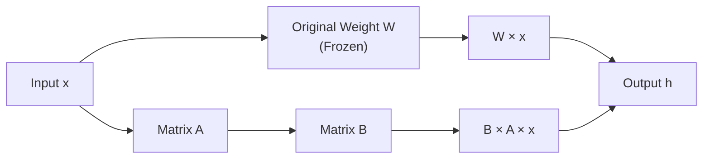
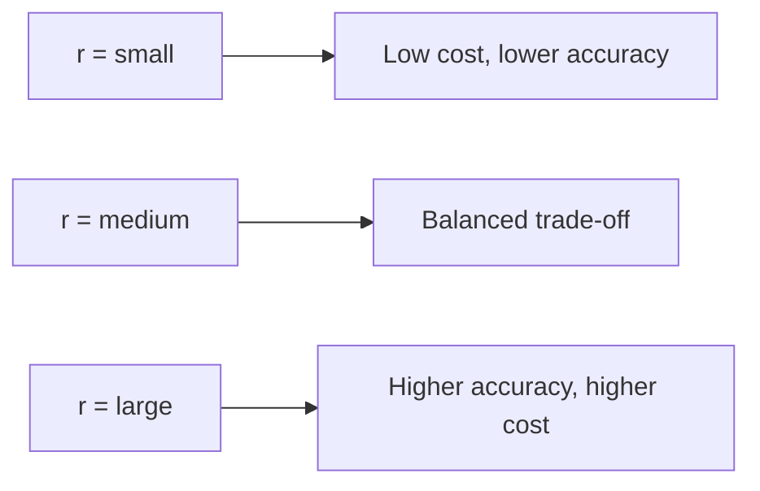
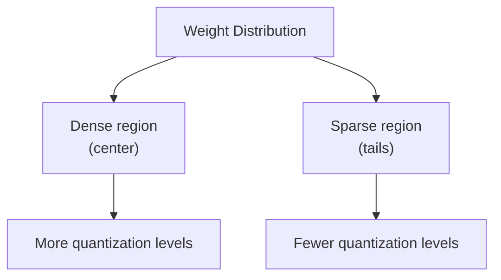
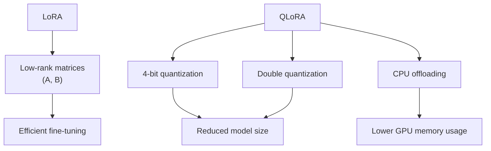

# LoRA and QLoRA Explained: Principles and Memory Optimization Techniques

## 1. Background: Why Efficient Fine-Tuning Matters

Fine-tuning large language models with all parameters is extremely expensive. Models with tens or hundreds of billions of parameters require enormous GPU memory, compute power, and storage. For most teams, full fine-tuning is simply not practical.

To address this, techniques like **LoRA** and **QLoRA** were introduced to significantly reduce the cost while maintaining high performance. 

---

## 2. LoRA: Low-Rank Adaptation

### 2.1 Core Idea

LoRA (Low-Rank Adaptation) is based on the concept of **low-rank decomposition**.

Instead of modifying the original model weights, LoRA:

* Keeps the original weights **frozen**
* Introduces **small trainable matrices** to represent updates

---

### 2.2 Intuition

Think of the model weights as a massive encyclopedia.

* Full fine-tuning → rewriting the entire book
* LoRA → adding annotations without changing the original text

---

### 2.3 Mathematical Formulation

LoRA modifies the forward pass as follows:

$$
h = Wx + BAx
$$

Where:

* **W**: original weight matrix (unchanged)
* **A, B**: small trainable matrices
* Only **A** and **B** are updated during training

---

### 2.4 Key Benefits

* Reduces trainable parameters by **orders of magnitude**
* Maintains performance close to full fine-tuning (~99%)
* Greatly lowers compute and storage requirements

---

### 2.5 Rank (r) Trade-off

The rank **r** controls model capacity:

* Typical values: **8–64**
* Larger **r** → better approximation, higher cost

---

## 3. QLoRA: Quantized LoRA

### 3.1 Motivation

While LoRA reduces the number of trainable parameters, it still requires loading the **full model weights into GPU memory**.

Example:

* A 65B model may require **~130GB GPU memory** just to load

QLoRA focuses on **reducing memory usage** so large models can run on limited hardware.

---

## 4. How QLoRA Optimizes GPU Memory

QLoRA introduces three major techniques:

---

### 4.1 4-bit Quantization (NF4)

Standard models use:

* **16-bit floating point (FP16)** → 2 bytes per parameter

QLoRA compresses weights to:

* **4-bit (0.5 bytes per parameter)**

#### NF4 (NormalFloat 4-bit)

Weights in neural networks typically follow a **normal distribution**.

NF4:

* Allocates more precision where weights are dense
* Reduces precision where weights are sparse
* Achieves high compression with minimal accuracy loss

---

### 4.2 Double Quantization

Quantization requires additional **scaling factors**.

These scaling factors also consume memory, so QLoRA:

* Applies quantization **again** to these constants

Result:

* Further reduces total memory footprint

---

### 4.3 CPU Offloading (Memory Paging)

During training, optimizers (e.g., Adam) store:

* Gradients
* Momentum

These can consume **more memory than the model itself**.

QLoRA uses dynamic offloading:

* Moves optimizer states to **CPU memory** when GPU is full
* Loads them back when needed
* Similar to **virtual memory in operating systems**

---

## 5. Summary

* **LoRA**: reduces training cost by limiting trainable parameters
* **QLoRA**: reduces memory usage, enabling large models to run on smaller hardware

Together, they make fine-tuning large models significantly more practical and accessible.

## Source: 
https://mp.weixin.qq.com/s/VA0YAeIYanzTiVkSnYrZUA