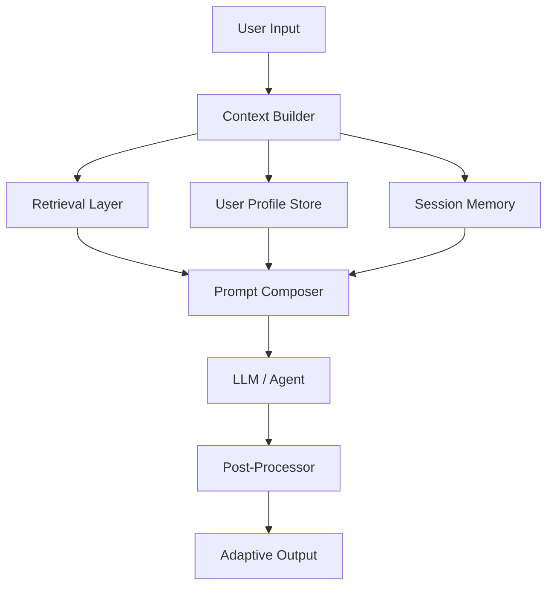
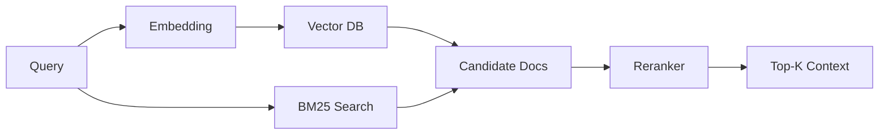
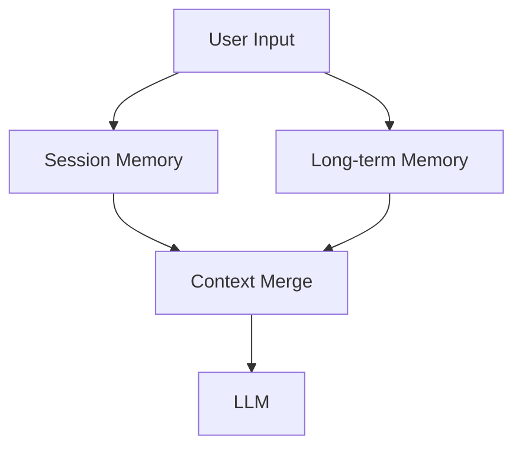
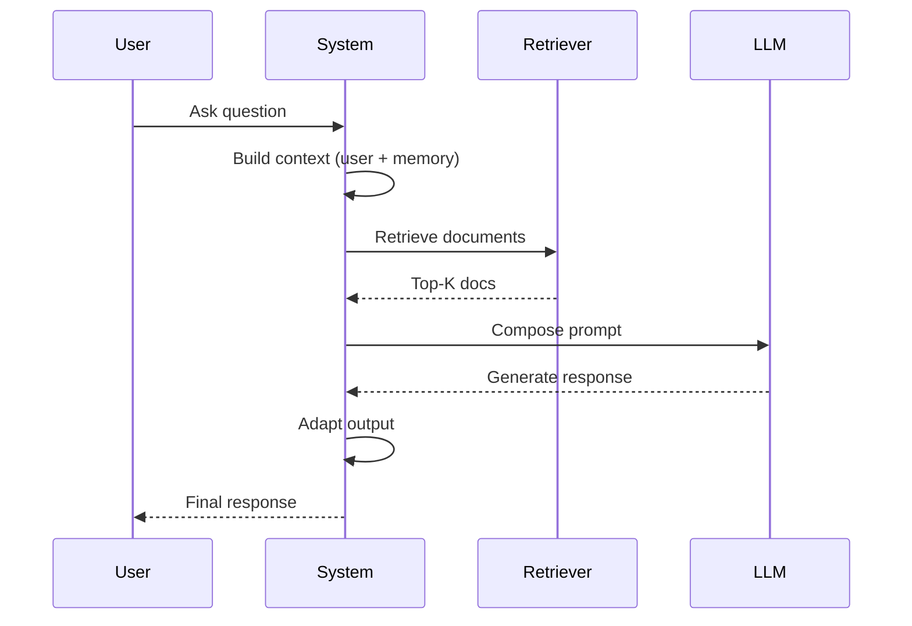

# Context-aware AI that Adapts to the Audience

Modern AI systems are no longer judged solely by raw intelligence—they are evaluated by how well they *adapt*. A truly useful AI system understands *who* it is talking to, *what* context matters, and *how* to adjust its behavior accordingly. This is the foundation of **context-aware AI**: systems that dynamically tailor responses based on audience, intent, and environment.

This article dives into the architecture, techniques, and emerging patterns behind building such systems in production.

---

## What is Context-aware AI?

Context-aware AI refers to systems that dynamically modify their outputs based on multiple layers of context:

* **User context**: role, expertise level, preferences
* **Task context**: intent, goal, constraints
* **System context**: available tools, memory, environment
* **Conversation context**: prior interactions, history

Unlike traditional prompt-based systems, context-aware AI continuously *reconstructs* the input before inference.

---

## Why It Matters

A single LLM response is rarely optimal for all audiences:

| Audience  | Desired Output                        |
| --------- | ------------------------------------- |
| Beginner  | Simple explanations, analogies        |
| Engineer  | Technical depth, trade-offs           |
| Executive | High-level summary, impact            |
| System    | Structured JSON, deterministic output |

Without adaptation, AI outputs become either:

* Too shallow for experts
* Too complex for beginners
* Too verbose for systems

---

## High-Level Architecture



---

## Core Components

### 1. Context Builder

The **Context Builder** is the brain of the system. It aggregates:

* User metadata (role, preferences)
* Session history
* External knowledge (RAG)
* System constraints

It produces a structured context object:

```json
{
  "user_level": "senior_engineer",
  "tone": "technical",
  "goal": "optimize retrieval quality",
  "history": [...],
  "constraints": ["low latency"]
}
```

---

### 2. Retrieval-Augmented Generation (RAG)

Context-aware systems rely heavily on **RAG pipelines**:

* Vector search (semantic similarity)
* Metadata filtering (e.g., `user_id`, `topic`)
* Hybrid retrieval (BM25 + embeddings)
* Reranking (cross-encoders like BGE reranker)



Key production improvements:

* **Chunking strategies** (semantic + sliding window)
* **Query rewriting** (expand intent)
* **Multi-query retrieval** (diversity boost)

---

### 3. Audience Modeling

Audience awareness is typically implemented using:

#### a. Rule-based Profiles

```yaml
beginner:
  style: "simple"
  max_depth: 2

engineer:
  style: "technical"
  include_code: true

executive:
  style: "concise"
  include_metrics: true
```

#### b. Learned Preferences

* Embedding user behavior
* Tracking interaction feedback
* Reinforcement learning (RLHF / RLAIF)

---

### 4. Prompt Composition Layer

Instead of static prompts, context-aware systems use **dynamic prompt templates**:

```text
System:
You are an AI assistant.

Adapt to the user's expertise level: {{user_level}}

Guidelines:
{{style_rules}}

Context:
{{retrieved_documents}}

User Question:
{{query}}
```

Advanced techniques:

* **Prompt routing** (different templates per task)
* **Tool-aware prompting** (decide when to call tools)
* **Chain-of-thought gating** (internal reasoning only)

---

### 5. Memory Systems

Memory is critical for maintaining context over time:

#### Types of Memory

| Type       | Description          |
| ---------- | -------------------- |
| Short-term | Current session      |
| Long-term  | Persistent user data |
| Episodic   | Past interactions    |
| Semantic   | Knowledge base       |



Common implementations:

* Redis (session cache)
* PostgreSQL + pgvector (long-term memory)
* Document stores (knowledge base)

---

### 6. Tool Use and Agents

Modern systems integrate **agents** that can:

* Call APIs
* Query databases
* Execute code
* Retrieve structured data

This enables **adaptive workflows** instead of static responses.

Example:

* Beginner → explanation
* Engineer → query logs + debug output
* System → return JSON schema

---

### 7. Output Adaptation

Post-processing ensures outputs match audience expectations:

* Format conversion (Markdown, JSON, UI components)
* Length control
* Tone adjustment
* Content filtering

---

## Advanced Techniques

### 1. Multi-Pass Reasoning

Instead of a single LLM call:

1. Understand intent
2. Retrieve context
3. Generate draft
4. Refine based on audience

---

### 2. Context Compression

Large contexts increase cost and latency. Solutions:

* Summarization
* Semantic filtering
* Token-aware ranking

---

### 3. Personalization via Embeddings

Store user embeddings:

* Preferences
* Past queries
* Domain expertise

Then use similarity search to tailor responses.

---

### 4. Reranking for Relevance

Cross-encoder rerankers significantly improve retrieval quality:

```text
Score(query, document) → relevance score
```

This reduces hallucination by ensuring high-quality context.

---

### 5. Evaluation Frameworks

Key metrics:

* **Relevance** (retrieval accuracy)
* **Faithfulness** (grounded in sources)
* **Adaptation quality** (matches audience)
* **Latency & cost**

---

## Example: End-to-End Flow



---

## Production Considerations

### Latency Optimization

* Cache embeddings
* Parallel retrieval
* Streaming responses (SSE)

### Cost Control

* Context pruning
* Model routing (small vs large LLMs)
* Token budgeting

### Reliability

* Fallback strategies
* Confidence scoring
* Guardrails

---

## Emerging Trends

### 1. Agentic Systems

AI systems that plan and execute multi-step workflows autonomously.

### 2. Multimodal Context

Combining text, images, audio, and structured data.

### 3. Fine-grained Personalization

Real-time adaptation based on behavior signals.

### 4. Local + Cloud Hybrid Models

Balancing privacy, latency, and capability.

### 5. Context Engineering as a Discipline

Designing context pipelines becomes as important as model choice.

---

## Conclusion

Context-aware AI is shifting the paradigm from **"one model fits all"** to **"one system adapts to all"**.

The key is not just better models—but better orchestration:

* Rich context construction
* High-quality retrieval
* Audience-aware prompting
* Adaptive output pipelines

Systems that master this will deliver significantly higher utility, trust, and user satisfaction.

