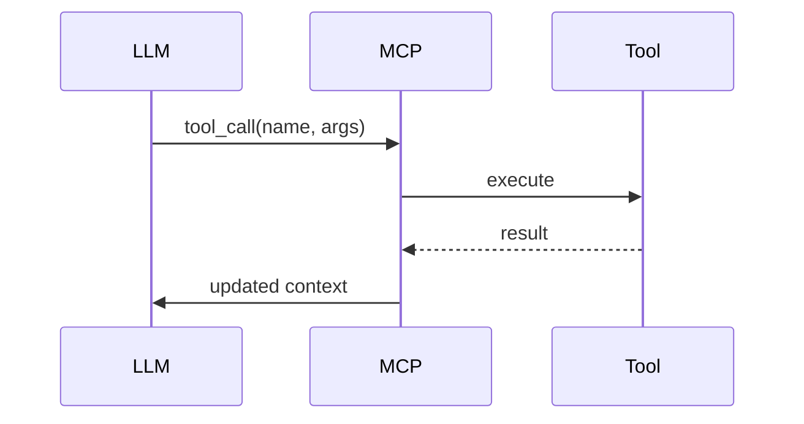
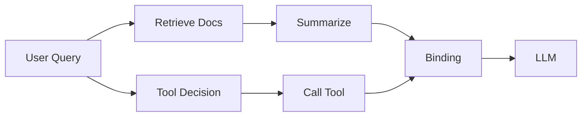

# Model Context Protocol (MCP): A Systems-Level Approach to Context-Aware AI

## Introduction

As large language models (LLMs) evolve from stateless text generators into stateful, tool-using agents, one core challenge persists: **context orchestration**. Traditional prompt engineering is insufficient for production systems that require dynamic grounding, tool interaction, and memory management.

The **Model Context Protocol (MCP)** emerges as a structured, interoperable standard for managing how context is **injected, retrieved, transformed, and consumed** by AI systems. Rather than treating context as a flat prompt string, MCP formalizes it as a **first-class, composable interface** between models, tools, and external systems.

This article explores MCP from a systems design perspective, including architecture, protocol design, and production considerations.

---

## Problem: Context Fragmentation in AI Systems

Modern AI applications often involve:

- Retrieval-Augmented Generation (RAG)
- Tool calling / function execution
- Multi-turn conversational memory
- External API integration
- Multi-agent coordination

Without a standard, these systems suffer from:

- **Ad hoc prompt construction**
- **Context duplication and drift**
- **Tight coupling between model and infrastructure**
- **Poor observability of context flow**

---

## MCP Overview

MCP defines a **protocol layer** that standardizes how context is structured and exchanged.

At its core, MCP introduces:

- **Context Units**: Structured pieces of information (documents, messages, tool outputs)
- **Context Graph**: A DAG representing dependencies between context units
- **Resolvers**: Components that fetch or compute context dynamically
- **Bindings**: Rules for mapping context into model-consumable format

---

## Architecture

```mermaid
flowchart TD
    A[User Input] --> B[Context Orchestrator]
    B --> C[Context Graph Builder]
    C --> D[Resolvers]
    D --> E[External Sources]
    E --> D
    D --> F[Context Units]
    F --> G[Bindings Layer]
    G --> H[LLM]
    H --> I[Tool Calls]
    I --> D


### Key Components

#### 1. Context Orchestrator

The entry point that manages:

* Request lifecycle
* Context graph construction
* Execution order

#### 2. Context Graph

A **directed acyclic graph (DAG)** where:

* Nodes = context units
* Edges = dependencies

Example:

```text
User Query
   ↓
Retrieve Documents → Summarize → Inject into Prompt
```

This allows:

* Lazy evaluation
* Dependency tracking
* Partial recomputation

---

## Context Units

Each context unit follows a structured schema:

```json
{
  "id": "doc:123",
  "type": "retrieved_document",
  "content": "...",
  "metadata": {
    "source": "knowledge_base",
    "embedding_score": 0.89
  },
  "dependencies": []
}
```

Types include:

* `user_message`
* `system_instruction`
* `retrieved_document`
* `tool_result`
* `memory_state`

---

## Resolvers

Resolvers are responsible for populating context units.

### Examples

#### Vector Retrieval Resolver

```go
func ResolveDocuments(query string) []Document {
    embedding := Embed(query)
    return VectorDB.Search(embedding, topK=5)
}
```

#### Tool Execution Resolver

```python
def resolve_tool_call(tool_name, args):
    result = call_external_api(tool_name, args)
    return ContextUnit(
        type="tool_result",
        content=result
    )
```

Resolvers can be:

* **Synchronous** (blocking)
* **Asynchronous** (parallel execution)
* **Cached** (memoized for reuse)

---

## Bindings: From Context to Prompt

Bindings transform structured context into model input.

### Example Binding Template

```text
System: You are a helpful assistant.

Context:
{{#each retrieved_documents}}
- {{this.content}}
{{/each}}

User: {{user_query}}
```

Bindings support:

* Conditional inclusion
* Ordering strategies (e.g., relevance, recency)
* Token budgeting

---

## Token Budgeting and Context Window Optimization

Given LLM constraints, MCP introduces **budget-aware context selection**:

```python
def select_context(units, max_tokens):
    sorted_units = rank_by_relevance(units)
    selected = []
    total = 0
    
    for unit in sorted_units:
        tokens = count_tokens(unit.content)
        if total + tokens > max_tokens:
            break
        selected.append(unit)
        total += tokens
    
    return selected
```

Advanced strategies include:

* **Semantic compression**
* **Hierarchical summarization**
* **Sliding window memory**

---

## Tool Calling Integration

MCP treats tool calls as first-class context nodes.

### Flow

1. LLM emits a tool call
2. MCP creates a `tool_request` node
3. Resolver executes the tool
4. Result becomes a `tool_result` node
5. Graph updates and rebinds context



---

## Memory Management

MCP supports multiple memory layers:

### 1. Short-Term Memory

* Current conversation
* Stored as recent context units

### 2. Long-Term Memory

* Persisted embeddings
* Retrieved via resolvers

### 3. Episodic Memory

* Structured events
* Useful for agent reasoning

---

## Observability and Debugging

Because MCP structures context explicitly, it enables:

* **Traceable context flow**
* **Replayable executions**
* **Unit-level inspection**

Example:

```json
{
  "trace_id": "abc123",
  "nodes": [
    {"id": "query", "latency_ms": 2},
    {"id": "retrieval", "latency_ms": 45},
    {"id": "binding", "tokens": 1200}
  ]
}
```

---

## MCP vs Traditional RAG

| Feature           | Traditional RAG | MCP         |
| ----------------- | --------------- | ----------- |
| Context Structure | Flat prompt     | Graph-based |
| Tool Integration  | Ad hoc          | First-class |
| Observability     | Limited         | Built-in    |
| Reusability       | Low             | High        |
| Execution Model   | Linear          | DAG-based   |

---

## Production Considerations

### 1. Concurrency

Resolvers can execute in parallel:

* Retrieval
* Tool calls
* Memory fetches

This aligns well with languages like Go for high-throughput systems.

### 2. Caching

* Context unit caching
* Embedding reuse
* Tool result memoization

### 3. Fault Tolerance

* Partial graph failure handling
* Fallback resolvers
* Retry strategies

### 4. Security

* Context sanitization
* Tool permission boundaries
* PII filtering

---

## Example: End-to-End Flow



---

## Conclusion

The Model Context Protocol (MCP) represents a shift from **prompt-centric AI design** to **context-centric system architecture**.

By formalizing:

* Context as structured data
* Execution as a graph
* Integration as protocol-driven

MCP enables:

* Scalable AI systems
* Better observability
* Cleaner separation of concerns

As AI systems grow more complex—with agents, tools, and dynamic memory—protocols like MCP will become foundational infrastructure, much like HTTP for the web.


