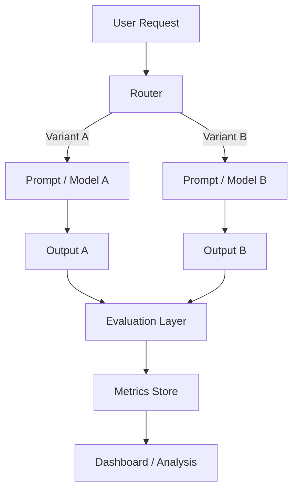

# A/B Testing LLM Outputs in Production Systems

Modern applications built on large language models (LLMs) behave less like deterministic software and more like probabilistic systems. Traditional testing strategies—unit tests, integration tests, snapshot comparisons—fail to capture the variability and emergent behavior of LLM outputs. As a result, **A/B testing becomes a first-class mechanism** for evaluating and iterating on LLM-powered features in production.

This article explores how to design, implement, and operationalize A/B testing pipelines for LLM outputs from a systems engineering perspective.

---

## Why A/B Testing is Essential for LLM Systems

Unlike conventional APIs, LLMs exhibit:

* **Non-determinism**: identical inputs can produce different outputs
* **Prompt sensitivity**: small prompt changes can drastically alter behavior
* **Model drift**: upstream model updates (e.g., via OpenAI APIs) may affect output quality
* **Evaluation ambiguity**: correctness is often subjective or context-dependent

Because of this, offline evaluation (BLEU, ROUGE, etc.) is insufficient. The real signal comes from **user interaction in production**.

---

## Core Architecture of an LLM A/B Testing System

A robust A/B testing system for LLMs consists of four main components:



### 1. Traffic Router

The router assigns incoming requests to experiment variants:

* **Deterministic hashing** (user_id → bucket)
* **Random sampling** (for anonymous users)
* **Sticky sessions** (ensures consistency across sessions)

Example:

```python
import hashlib

def assign_variant(user_id: str) -> str:
    h = hashlib.md5(user_id.encode()).hexdigest()
    return "A" if int(h, 16) % 2 == 0 else "B"
```

---

### 2. Variant Definition

Each variant may differ across multiple dimensions:

| Dimension       | Examples                               |
| --------------- | -------------------------------------- |
| Prompt          | System instructions, few-shot examples |
| Model           | `gpt-4.1` vs `gpt-4o-mini`             |
| Parameters      | temperature, top_p                     |
| Post-processing | JSON parsing, filtering                |

Example:

```python
VARIANTS = {
    "A": {
        "model": "gpt-4.1",
        "prompt_template": PROMPT_V1,
        "temperature": 0.2,
    },
    "B": {
        "model": "gpt-4o-mini",
        "prompt_template": PROMPT_V2,
        "temperature": 0.7,
    }
}
```

---

### 3. Evaluation Layer

This is the most critical—and hardest—component.

#### Types of Evaluation

**1. Explicit Feedback**

* Thumbs up/down
* Ratings (1–5)
* User selection between outputs

**2. Implicit Signals**

* Click-through rate (CTR)
* Time spent
* Follow-up queries
* Abandonment rate

**3. LLM-as-a-Judge**
Use another LLM to evaluate outputs:

```python
def judge(output_a, output_b, query):
    prompt = f"""
    Compare two answers to the same question.

    Question: {query}

    Answer A:
    {output_a}

    Answer B:
    {output_b}

    Which is better and why? Respond with A or B.
    """
    return call_llm(prompt)
```

This approach is widely used but introduces **evaluation bias** and must be calibrated.

---

### 4. Metrics and Storage

All experiment data should be logged with full traceability:

```json
{
  "request_id": "uuid",
  "user_id": "hashed",
  "variant": "A",
  "prompt": "...",
  "output": "...",
  "latency_ms": 842,
  "tokens_used": 512,
  "feedback": "thumbs_up",
  "timestamp": "2026-05-04T12:00:00Z"
}
```

Recommended storage:

* OLTP: PostgreSQL
* Analytics: ClickHouse / BigQuery
* Logs: ELK stack

---

## Practical Example: Improving a RAG Answering System

Consider a production RAG system answering technical questions (similar to an internal knowledge assistant).

### Hypothesis

> Adding structured reasoning instructions improves answer quality.

### Variant Design

**Variant A (Baseline)**

```text
Answer the question using the provided context.
```

**Variant B (Enhanced Prompt)**

```text
You are a senior engineer. Follow these steps:
1. Extract relevant facts
2. Reason step-by-step
3. Provide a concise answer

Context:
{context}
```

---

### Implementation (Simplified)

```python
def generate_answer(query, context, variant):
    config = VARIANTS[variant]

    prompt = config["prompt_template"].format(
        query=query,
        context=context
    )

    response = openai.chat.completions.create(
        model=config["model"],
        messages=[{"role": "user", "content": prompt}],
        temperature=config["temperature"],
    )

    return response.choices[0].message.content
```

---

### Evaluation Strategy

* **Primary metric**: user thumbs-up rate
* **Secondary metrics**:

  * average response length
  * follow-up clarification rate
  * latency

---

### Results (Example)

| Metric         | Variant A | Variant B |
| -------------- | --------- | --------- |
| Thumbs-up rate | 62%       | 74%       |
| Avg. latency   | 820 ms    | 910 ms    |
| Follow-up rate | 28%       | 19%       |

**Interpretation**:

* Variant B improves quality significantly
* Slight latency increase is acceptable
* Reduced follow-ups indicate better clarity

---

## Advanced Techniques

### 1. Multi-Armed Bandits

Instead of fixed A/B splits, dynamically allocate traffic:

* **ε-greedy**
* **Thompson Sampling**
* **UCB (Upper Confidence Bound)**

This allows faster convergence toward better variants.

---

### 2. Interleaving Outputs

For ranking tasks (e.g., search results), interleave outputs from multiple variants and measure user preference implicitly.

---

### 3. Offline Replay Testing

Replay historical queries against new variants:

```python
for request in historical_dataset:
    new_output = generate_answer(
        request.query,
        request.context,
        variant="B"
    )
    evaluate(new_output, request.ground_truth)
```

This reduces risk before production rollout.

---

### 4. Guardrails and Safety Evaluation

Integrate safety checks into experiments:

* Toxicity classifiers
* Regex / policy filters
* Secondary LLM moderation

This is especially important when experimenting with higher-temperature variants.

---

## Common Pitfalls

### 1. Evaluation Leakage

Using the same model family for generation and judging can bias results.

---

### 2. Metric Misalignment

Optimizing for CTR may degrade answer correctness.

---

### 3. Small Sample Sizes

LLM variance requires **large sample sizes** for statistical significance.

---

### 4. Prompt Overfitting

Variants may perform well on test queries but fail in real-world distribution.

---

## Production Considerations

### Observability

Track:

* token usage (cost)
* latency percentiles (P50, P95)
* error rates
* fallback triggers

---

### Cost Control

A/B testing doubles inference cost. Strategies:

* sample only a subset of traffic
* use cheaper models for exploration (e.g., `gpt-4o-mini`)
* cache repeated queries

---

### Versioning

Always version:

* prompts
* models
* evaluation logic

Example:

```text
experiment_id: rag_prompt_v2_vs_v3
model_version: gpt-4.1-2026-04
prompt_hash: sha256(...)
```

---

## Conclusion

A/B testing for LLM systems is not just an optimization tool—it is a **core reliability mechanism**. It bridges the gap between offline experimentation and real-world performance, enabling continuous improvement in systems where correctness is probabilistic and context-dependent.

By combining structured experimentation, robust evaluation pipelines, and production-grade observability, engineers can safely iterate on LLM-powered features and deliver measurable improvements in user experience.
