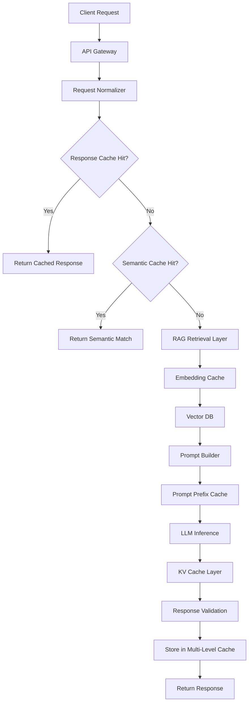
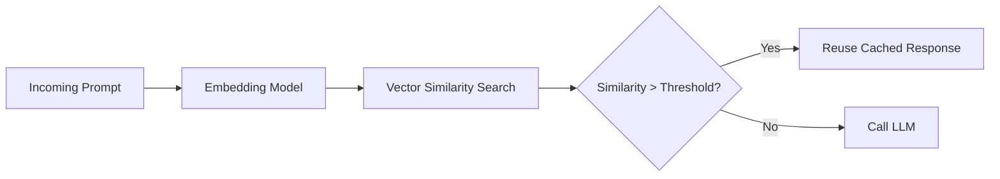
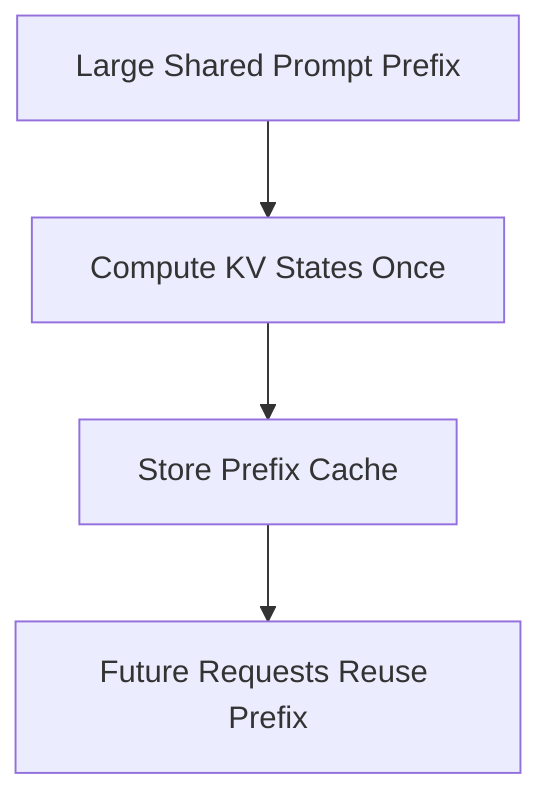
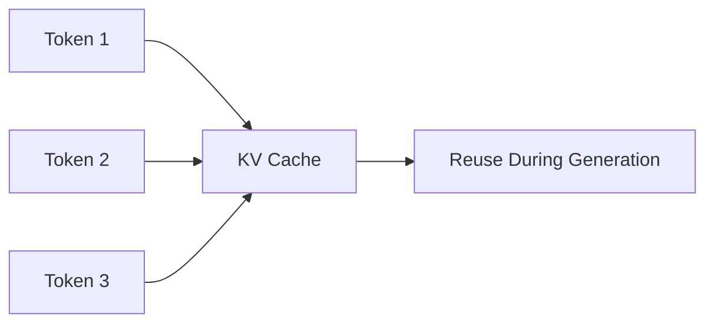
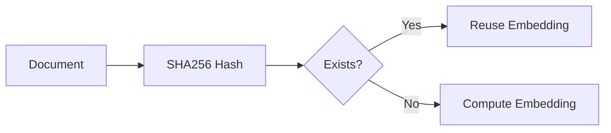
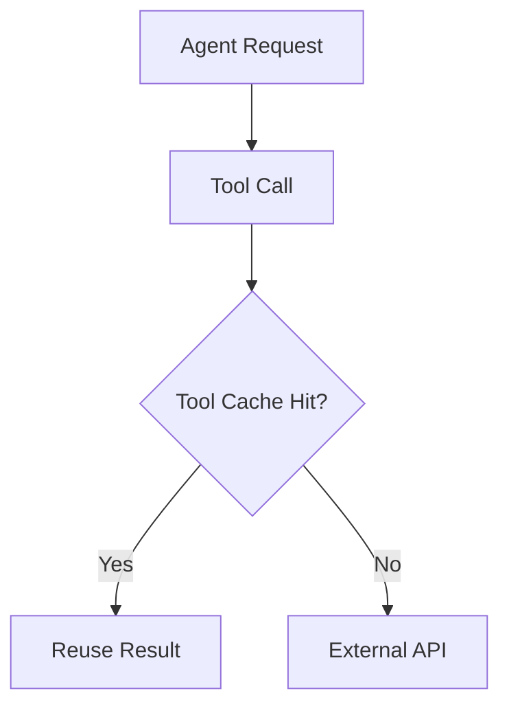
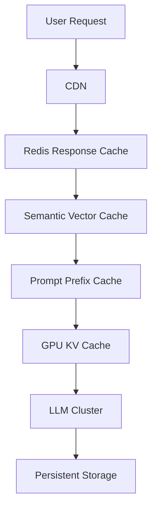

# Designing Production-Grade Caching Systems for LLM Applications

Large Language Models are expensive.

The problem is not just token pricing. In production systems, repeated LLM calls create cascading issues:

* higher latency
* API rate limiting
* queue buildup
* GPU saturation
* increased retry traffic
* degraded UX
* infrastructure cost explosions

For many real-world AI systems, the bottleneck is not the model quality anymore. It is inference economics.

Caching is one of the highest ROI optimizations in modern LLM architecture.

Traditional distributed systems have used caching for decades — CDNs, Redis, query caches, HTTP caches, JVM caches, DNS caches. LLM systems now require a new generation of caching strategies because the workload characteristics are fundamentally different:

* prompts are semi-structured
* responses are probabilistic
* semantic similarity matters
* prompts may partially overlap
* context windows are enormous
* inference cost scales with token count

Modern LLM infrastructure therefore uses **multi-layer caching architectures** instead of a single cache layer.

---

# Why LLM Systems Need Specialized Caching

Traditional API caching usually works like this:

```text
request hash -> cached response
```

LLMs break this assumption.

These two prompts are semantically identical:

```text
"What is the capital of France?"
```

```text
"Tell me France's capital city."
```

But their hashes are different.

Meanwhile, many production AI systems repeatedly send large identical prefixes:

* system prompts
* policy instructions
* RAG context templates
* tool schemas
* conversation memory
* few-shot examples

In enterprise AI systems, these prefixes may exceed 10k–100k tokens.

Recomputing them repeatedly is wasteful.

This created several specialized caching categories:

| Cache Type           | Purpose                            |
| -------------------- | ---------------------------------- |
| Response Cache       | Reuse exact output                 |
| Semantic Cache       | Reuse semantically similar output  |
| Prompt Prefix Cache  | Reuse shared prompt prefixes       |
| KV Cache             | Reuse transformer attention states |
| Embedding Cache      | Avoid recomputing embeddings       |
| Tool Result Cache    | Avoid repeated external API calls  |
| RAG Retrieval Cache  | Reuse retrieval results            |
| Agent Workflow Cache | Reuse multi-step execution chains  |

---

# High-Level Production Architecture



Production systems rarely rely on a single cache.

Instead they stack multiple layers because each solves different latency and cost problems.

---

# Layer 1 — Exact Response Caching

The simplest strategy.

## Architecture

```text
normalized_prompt_hash -> llm_response
```

Usually implemented with:

* Redis
* Memcached
* DynamoDB
* PostgreSQL JSONB
* KeyDB

---

# Prompt Normalization Is Critical

Without normalization, cache hit rates collapse.

Production systems normalize:

* whitespace
* timestamps
* UUIDs
* ordering
* session metadata
* tracing IDs

Example:

Before normalization:

```json
{
  "query": "Summarize this document",
  "timestamp": "2026-05-15T10:12:11"
}
```

After normalization:

```json
{
  "query": "Summarize this document"
}
```

---

# Production Example — Customer Support AI

Imagine a SaaS support chatbot.

Thousands of users ask:

```text
"How do I reset my password?"
```

Without cache:

```text
Every request -> OpenAI API call
```

With response cache:

```text
First request -> LLM
Next 20,000 requests -> Redis
```

This can reduce:

* latency from 2 seconds → 20 ms
* token cost near zero
* provider rate pressure dramatically

---

# Production Redis Example

```python
import hashlib
import json
import redis

r = redis.Redis(host="localhost", port=6379)

def normalize_prompt(prompt: str):
    return prompt.strip().lower()

def cache_key(prompt: str):
    normalized = normalize_prompt(prompt)
    return hashlib.sha256(normalized.encode()).hexdigest()

def get_cached_response(prompt):
    key = cache_key(prompt)
    return r.get(key)

def store_response(prompt, response, ttl=3600):
    key = cache_key(prompt)
    r.setex(key, ttl, response)
```

---

# Layer 2 — Semantic Caching

Exact-match caching alone performs poorly because human language is flexible.

Semantic caching solves this using embeddings.

Instead of:

```text
exact text match
```

It uses:

```text
semantic similarity
```

---

# Architecture



---

# Semantic Cache Design

Typical components:

| Component         | Technology                 |
| ----------------- | -------------------------- |
| Embeddings        | OpenAI / Voyage / BGE      |
| Vector DB         | pgvector / Qdrant / Milvus |
| Similarity Metric | cosine similarity          |
| Cache Store       | Redis / Postgres           |
| Validation Layer  | optional LLM judge         |

---

# Threshold Tuning Problem

This is where production systems become difficult.

Example:

```text
Prompt A:
"How do I deploy FastAPI on AWS Lambda?"

Prompt B:
"How do I deploy Django on EC2?"
```

Semantically similar?

Maybe.

But reusing the same answer would be incorrect.

This is the danger of semantic caching:

```text
false semantic matches
```

Production systems therefore use:

* similarity thresholds
* metadata filtering
* topic partitioning
* intent classification
* LLM verification layers

Recent research proposes asynchronous LLM-verified semantic caching to reduce incorrect cache reuse in enterprise systems. ([arXiv][1])

---

# Production Example — AI Coding Assistant

A coding assistant receives:

```text
"How do I center a div in CSS?"
```

and later:

```text
"CSS flexbox center alignment example"
```

Embedding similarity:

```text
0.96 cosine similarity
```

The system reuses the cached answer.

No expensive LLM call needed.

At scale, this can eliminate millions of redundant requests.

---

# Layer 3 — Prompt Prefix Caching

This is one of the most important modern optimizations.

Providers like OpenAI and Anthropic now support prompt caching natively. ([OpenAI Developers][2])

---

# The Core Insight

Many prompts share huge identical prefixes.

Example:

```text
[System Prompt]
[Company Policies]
[Tool Schemas]
[RAG Context]
[Conversation History]
[User Question]
```

Only the final user question changes.

Why recompute the earlier 50k tokens every time?

---

# Prefix Cache Flow



---

# OpenAI Prompt Caching

OpenAI introduced automatic prompt caching for long shared prefixes. ([OpenAI Developers][2])

According to OpenAI documentation:

* reduced latency up to 80%
* lower token costs
* automatic reuse of repeated prompt prefixes

This is especially effective for:

* agent frameworks
* RAG systems
* enterprise copilots
* coding assistants

---

# Anthropic Prompt Caching

Anthropic supports explicit prompt caching using `cache_control`. ([Claude][3])

Example:

```json
{
  "cache_control": {
    "type": "ephemeral"
  }
}
```

Anthropic allows developers to explicitly mark cacheable prompt regions.

This is useful for:

* long policy documents
* static context
* reusable tool definitions
* persistent system prompts

---

# Critical Production Optimization

Ordering matters enormously.

Providers cache prefixes.

Therefore:

```text
Put stable content FIRST.
Put dynamic content LAST.
```

Good:

```text
[Stable Instructions]
[Stable Policies]
[Stable Tool Schema]
[Dynamic User Input]
```

Bad:

```text
[Timestamp]
[Session Metadata]
[Dynamic Variables]
[Stable Instructions]
```

Even one changing token early in the prompt can destroy cache hits. ([Medium][4])

---

# Layer 4 — KV Cache

KV cache operates inside transformer inference itself.

This is lower-level than response caching.

---

# Why KV Cache Exists

Transformers repeatedly recompute attention states.

Without caching:

```text
O(n²) attention recomputation
```

With KV caching:

```text
reuse previous token attention states
```

This dramatically improves generation efficiency.

---

# KV Cache Concept



---

# Enterprise Inference Systems

Open-source serving frameworks now heavily optimize KV caching:

* vLLM
* SGLang
* TensorRT-LLM
* LMCache

vLLM implements automatic prefix KV caching to avoid repeated prompt computation. ([vLLM][5])

Research systems like LMCache extend this further by sharing KV cache across inference engines and distributed serving nodes. ([arXiv][6])

---

# Why KV Cache Is Difficult

KV caches consume massive memory.

Large-context requests can require gigabytes of GPU memory. ([Medium][7])

Production systems therefore need:

* eviction policies
* compression
* tiered storage
* CPU offloading
* SSD spillover
* memory-aware scheduling

---

# Layer 5 — Embedding Caching

RAG systems often waste money recomputing embeddings.

Example:

```text
Same document embedded repeatedly
```

Production fix:

```text
document_hash -> embedding_vector
```

---

# Common Production Pattern



---

# Real Production Example

Imagine ingesting:

* GitHub repos
* PDFs
* Confluence pages
* Jira tickets

Without embedding cache:

```text
every sync recomputes all embeddings
```

With content hashing:

```text
only changed chunks re-embed
```

This massively reduces:

* embedding API cost
* ingestion time
* vector DB writes

---

# Layer 6 — Tool Call Caching

Agentic systems create another problem.

Many expensive operations are not LLM calls.

They are:

* SQL queries
* weather APIs
* GitHub APIs
* CRM lookups
* vector retrieval
* Elasticsearch queries

Modern agent systems therefore cache tool outputs separately.

Recent research proposes hierarchical caches specifically for multi-agent workflows and tool execution reuse. ([arXiv][1])

---

# Production Agent Example



---

# Cache Invalidation Is the Hard Part

Classic systems principle:

```text
"There are only two hard things in Computer Science:
cache invalidation and naming things."
```

LLM systems make invalidation even harder.

---

# Common Strategies

| Strategy                 | Usage                     |
| ------------------------ | ------------------------- |
| TTL                      | Simple expiration         |
| Versioned Cache Keys     | Prompt versioning         |
| Model Version Keys       | Avoid stale generations   |
| Data Freshness Tags      | RAG consistency           |
| Semantic Drift Detection | Detect outdated responses |
| Human Review Flags       | Enterprise validation     |

---

# Example Production Cache Key

```text
model:gpt-4.1
prompt_version:v12
policy_version:v3
query_hash:abc123
```

This prevents stale responses after prompt changes.

---

# Multi-Level Cache Design

Production AI systems typically use:

| Layer               | Purpose                |
| ------------------- | ---------------------- |
| CDN                 | Static assets          |
| Redis               | Hot response cache     |
| Vector DB           | Semantic cache         |
| GPU KV Cache        | Inference optimization |
| Disk/Object Storage | Long-term persistence  |

---

# Real Enterprise Architecture



---

# Observability Is Mandatory

Caching without observability becomes dangerous.

Production systems monitor:

| Metric              | Meaning                    |
| ------------------- | -------------------------- |
| cache_hit_rate      | reuse efficiency           |
| semantic_hit_rate   | semantic reuse success     |
| false_hit_rate      | incorrect semantic matches |
| token_savings       | cost optimization          |
| latency_reduction   | UX improvement             |
| GPU_memory_pressure | KV cache saturation        |
| cache_evictions     | memory instability         |

---

# Typical Production Results

Well-designed caching systems can achieve:

| Optimization      | Typical Improvement       |
| ----------------- | ------------------------- |
| Prompt caching    | 50–90% token reduction    |
| Response caching  | near-zero latency         |
| Semantic caching  | 20–60% fewer LLM calls    |
| KV caching        | major throughput increase |
| Embedding caching | huge ingestion savings    |

OpenAI documents significant latency and token-cost reduction using prompt caching. ([OpenAI Developers][2])

Anthropic similarly documents major cost and latency reductions for repeated context reuse. ([Claude][3])

---

# Production Failure Modes

Caching is powerful, but dangerous when implemented incorrectly.

---

# 1. Semantic Cache Poisoning

Wrong semantic match reused.

Result:

```text
confidently incorrect answer
```

Fixes:

* stricter thresholds
* metadata partitioning
* LLM verification

---

# 2. Dynamic Prompt Fragments Breaking Prefix Cache

Adding timestamps early in prompts destroys cache hits.

Fix:

```text
stable prefix first
```

---

# 3. Cache Stampedes

Thousands of identical cache misses simultaneously trigger LLM calls.

Fixes:

* distributed locks
* request coalescing
* stale-while-revalidate

---

# 4. Stale RAG Data

Cached response references outdated enterprise data.

Fixes:

* source-version tagging
* retrieval timestamps
* cache invalidation hooks

---

# 5. GPU KV Cache Exhaustion

Long-context workloads consume all GPU memory.

Fixes:

* eviction policies
* quantized KV cache
* tiered storage

---

# Practical Production Advice

The best production systems combine:

```text
exact cache
+ semantic cache
+ prompt prefix cache
+ KV cache
+ retrieval cache
```

instead of relying on one strategy.

The most important optimization is usually not model selection.

It is reducing unnecessary inference.

---

# Final Thoughts

Caching is becoming a foundational layer of LLM infrastructure.

As context windows grow toward millions of tokens and agentic workflows become more common, inference reuse becomes essential for scalability.

Modern AI systems are increasingly converging toward architectures where:

* prompts become reusable assets
* attention states become distributed infrastructure
* semantic similarity becomes a cache primitive
* inference becomes partially memoized computation

The future of production AI is not only about better models.

It is about eliminating unnecessary computation.

---

# References

* [OpenAI Prompt Caching Docs](https://developers.openai.com/api/docs/guides/prompt-caching?utm_source=chatgpt.com)
* [Anthropic Prompt Caching Docs](https://platform.claude.com/docs/en/build-with-claude/prompt-caching?utm_source=chatgpt.com)
* [vLLM Prefix Caching Design](https://docs.vllm.ai/en/stable/design/prefix_caching/?utm_source=chatgpt.com)
* [Azure OpenAI Prompt Caching Guide](https://learn.microsoft.com/en-us/azure/foundry/openai/how-to/prompt-caching?utm_source=chatgpt.com)
* [OpenAI Prompt Caching Cookbook](https://developers.openai.com/cookbook/examples/prompt_caching101?utm_source=chatgpt.com)
* [LMCache Research Paper](https://arxiv.org/abs/2510.09665?utm_source=chatgpt.com)
* [Prompt Cache Research Paper](https://arxiv.org/abs/2311.04934?utm_source=chatgpt.com)
* [KV Cache Optimization Strategies Paper](https://arxiv.org/abs/2603.20397?utm_source=chatgpt.com)

[1]: https://arxiv.org/abs/2602.13165?utm_source=chatgpt.com "Asynchronous Verified Semantic Caching for Tiered LLM Architectures"
[2]: https://developers.openai.com/api/docs/guides/prompt-caching?utm_source=chatgpt.com "Prompt caching | OpenAI API"
[3]: https://platform.claude.com/docs/en/build-with-claude/prompt-caching?utm_source=chatgpt.com "Prompt caching - Claude API Docs"
[4]: https://medium.com/%40michael.hannecke/prompt-caching-explained-what-it-is-what-it-isnt-and-when-to-use-it-9f5c6fce7bdb?utm_source=chatgpt.com "Prompt Caching: What It Is, What It Is Not"
[5]: https://docs.vllm.ai/en/stable/design/prefix_caching/?utm_source=chatgpt.com "Automatic Prefix Caching - vLLM"
[6]: https://arxiv.org/abs/2510.09665?utm_source=chatgpt.com "LMCache: An Efficient KV Cache Layer for Enterprise-Scale LLM Inference"
[7]: https://medium.com/%40michael.hannecke/llm-prompt-caching-what-you-should-know-2665d76d3d8d?utm_source=chatgpt.com "LLM Prompt Caching: What You Should Know"
