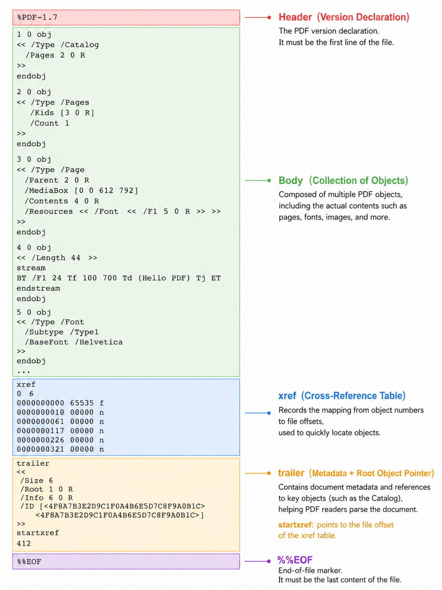
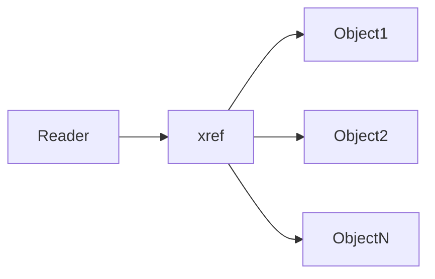
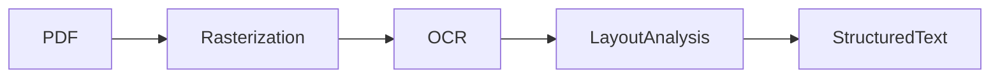
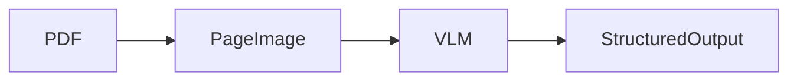
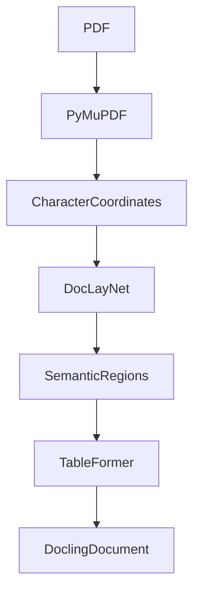
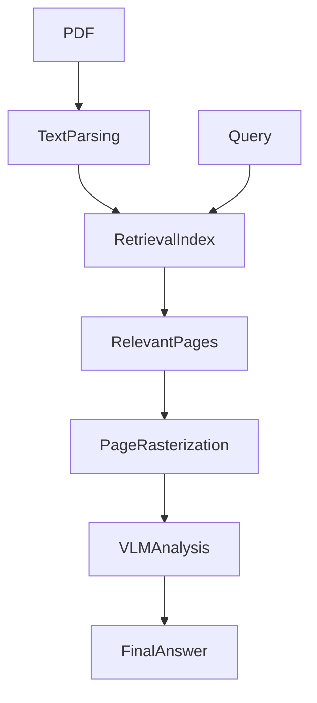

# RAG and PDF Parsing: Why It Is Still One of the Hardest Problems in Production AI Systems

> Prompt engineering keeps evolving. Models keep changing. Chunking strategies become more sophisticated. Retrieval pipelines gain rerankers, hybrid search, metadata filters, semantic chunking, and multi-stage retrieval.
>
> Yet in production RAG systems, the biggest problem is often still:
>
> **garbage in, garbage out.**
>
> And one of the largest sources of garbage is PDF parsing.

---

# Introduction

Modern Retrieval-Augmented Generation (RAG) systems rely heavily on document ingestion quality. Teams spend enormous effort optimizing embeddings, retrieval strategies, rerankers, and LLM orchestration, but frequently overlook the most fragile layer in the entire pipeline:

**document parsing**.

Among all enterprise document formats, PDF is by far the most difficult to parse correctly.

Unlike DOCX or HTML, PDF was never designed for semantic understanding. It was designed for visual fidelity.

This architectural decision creates deep structural problems for AI systems:

* broken reading order
* malformed tables
* missing Unicode mappings
* multi-column confusion
* cross-page semantic fragmentation
* OCR degradation
* chart information loss
* footnote corruption
* layout ambiguity

In production RAG pipelines, these failures directly reduce retrieval quality and increase hallucinations.

This article explains:

* why PDF parsing is fundamentally difficult
* how PDF internals actually work
* major parsing architectures
* OCR vs native extraction vs VLM approaches
* production-grade parsing frameworks
* common failure modes in enterprise RAG systems
* architectural mitigation strategies

---

# Why PDF Is Fundamentally Different

Among mainstream document formats, DOCX, HTML, and PDF represent completely different philosophies.

---

# DOCX: Semantic-First Design

DOCX is fundamentally a structured semantic document.

A DOCX file is essentially:

* a ZIP archive
* containing XML trees
* explicitly encoding document semantics

For example:

* headings
* paragraphs
* tables
* lists
* sections

are all directly represented in XML.

The rendering engine decides how these semantic structures should appear visually.

A parser simply traverses the XML tree.

No spatial inference is required.

---

# HTML: Semantic Tags + Styling Separation

HTML also prioritizes semantics.

Examples:

```html
<h1>Main Title</h1>
<table>
<tr>
<td>Value</td>
</tr>
</table>
```

Even if CSS visually changes the appearance:

```css
h1 {
  font-size: 8px;
}
```

the semantic meaning remains intact.

Parsing HTML is fundamentally:

> reading tags rather than inferring layout.

---

# PDF: Rendering-First Architecture

PDF is completely different.

PDF is a **Page Description Language (PDL)** originally derived from PostScript.

Its goal is not semantic understanding.

Its goal is:

* visual consistency
* printer portability
* layout fidelity
* device-independent rendering

A PDF page does **not** contain concepts like:

* paragraphs
* headings
* tables
* sections
* reading order

Instead, it contains:

* coordinates
* glyphs
* vector lines
* colors
* drawing instructions

A parser must reconstruct semantics purely from spatial relationships.

This is the root cause of nearly every PDF parsing problem in RAG systems.

---

# PDF Internal Structure

A PDF file contains four major sections:

```text
PDF File
├── Header
├── Body
├── Cross-Reference Table (xref)
└── Trailer
```

---

# Body: COS Objects

The PDF body contains COS objects (Carousel Object System objects).

Common object types:

| Object Type        | Purpose                     |
| ------------------ | --------------------------- |
| Dictionary         | Structural metadata         |
| Stream             | Raw page content            |
| Array              | Page trees, font lists      |
| String             | Text data                   |
| Indirect Reference | References to other objects |

Example:

```text
<< /Type /Page /MediaBox [...] >>
```

---

# Cross-Reference Table (xref)

The xref table stores byte offsets for all objects.

This enables random access without scanning the entire file.



---

# Content Streams

Actual text rendering instructions are stored inside page content streams.

Example:

```text
BT
  /F1 12 Tf
  72 720 Td
  (Hello, PDF!) Tj
  0 -14 Td
  [(Rag) 20 ( pipeline)] TJ
ET
```

This means:

| Operator | Meaning                |
| -------- | ---------------------- |
| BT       | Begin text object      |
| Tf       | Select font            |
| Td       | Move cursor            |
| Tj       | Draw text              |
| TJ       | Draw text with spacing |
| ET       | End text object        |

The parser reconstructs page content by interpreting rendering operations.

---

# Why PDF Parsing Is Structurally Hard

## 1. No Explicit Reading Order

PDF stores text in rendering order.

Not reading order.

For single-column documents:

```text
render order ≈ reading order
```

For multi-column layouts:

```text
render order != reading order
```

Example:

```text
Correct:
[Left] Introduction
[Left] We propose...
[Right] Abstract
[Right] Prior work...
```

Broken extraction:

```text
Introduction
Abstract
We propose...
Prior work...
```

This destroys semantic continuity.

---

## 2. Tables Are Not Real Data Structures

A PDF table is merely:

* lines
* positioned text
* spatial alignment

There is no actual table object.

The parser must infer:

* row boundaries
* column boundaries
* merged cells
* header hierarchy

Merged cells are especially destructive.

---

## 3. Font Encoding Problems

PDF stores:

```text
glyph IDs
```

not Unicode characters.

The parser must map glyphs back to Unicode using:

```text
ToUnicode CMap
```

Failures happen when:

* mappings are missing
* Type 3 fonts are custom
* CIDFonts are complex
* subsets are incomplete

Result:

```text
Attention Is All You Need
```

becomes:

```text
偛整匯數整數搔搔数搔數
```

---

## 4. Scanned PDFs Have No Text Layer

Scanned PDFs contain only raster images.

No text stream exists.

Text extraction returns nothing.

OCR becomes mandatory.

---

# Three Major PDF Parsing Architectures

Modern PDF parsing systems generally fall into three categories.

---

# 1. Native Text Extraction

This is the fastest approach.

Suitable for:

* digitally generated PDFs
* structured documents
* clean typography

Pipeline:


Popular libraries:

* PyMuPDF
* pdfplumber
* pypdf

---

# Native Extraction Challenges

The parser receives disconnected glyph coordinates.

It must reconstruct:

* words
* sentences
* paragraphs
* sections

This reconstruction quality differentiates parsing libraries.

---

# 2. OCR Pipelines

OCR is required for scanned documents.

Pipeline:



---

# Tesseract

Tesseract:

* binarizes images
* detects connected components
* applies LSTM transcription

Weaknesses:

* multi-column layouts
* complex formatting
* table reconstruction

---

# PaddleOCR

PaddleOCR improves by adding:

* layout detection
* region segmentation
* multilingual optimization

Especially strong for:

* Chinese documents
* academic PDFs
* mixed layouts

---

# OCR Weaknesses

OCR alone still struggles with:

* table structure
* chart semantics
* layout ambiguity
* reading order reconstruction

Errors cascade quickly.

---

# 3. Vision-Language Models (VLMs)

VLMs bypass most traditional parsing stages.

Instead of reconstructing coordinates:

the entire page becomes an image input.

Pipeline:



---

# Advantages of VLM Parsing

VLMs naturally understand:

* multi-column layouts
* nested tables
* merged cells
* charts
* diagrams
* handwritten annotations

They eliminate many heuristic reconstruction steps.

---

# VLM Weaknesses

However:

* inference cost is high
* latency is high
* hallucinations exist
* privacy/compliance concerns remain

---

# Mainstream PDF Parsing Solutions

---

# Lightweight Parsing Libraries

## PyMuPDF

Based on the MuPDF engine.

Strengths:

* high PDF compatibility
* very fast
* stable extraction for clean layouts

### PyMuPDF4LLM

Adds:

* Markdown formatting
* heading reconstruction
* simple table rebuilding

---

## pdfplumber

Built on pdfminer.six.

Specialized for tables.

Method:

* detect horizontal/vertical lines
* compute intersections
* infer cell boundaries

Works well for:

* bordered tables

Fails for:

* borderless tables
* merged cells

---

# AI-Enhanced Parsing Frameworks

These systems combine:

* native extraction
* layout analysis
* semantic reconstruction

---

# Docling

Architecture:



---

# DoclingDocument

Docling introduces a hierarchical document tree.

Each node contains:

* semantic type
* hierarchy position
* page coordinates

Example:

```text
Document
├── Heading
├── Paragraph
├── Table
└── Image
```

This is extremely valuable for RAG chunking.

Instead of chunking raw text heuristically:

the pipeline can chunk directly by semantic structure.

---

# MinerU

Uses:

* PaddleOCR
* PDF-Extract-Kit

Strong in:

* Chinese documents
* LaTeX-heavy papers
* academic PDFs

---

# Marker-PDF

Unified multi-format ingestion framework.

Supports:

* PDF
* DOCX
* PPTX
* XLSX
* EPUB
* HTML
* images

Useful for heterogeneous enterprise knowledge bases.

---

# Commercial APIs

Most cloud vendors now provide hosted parsing APIs.

Advantages:

* turnkey deployment
* managed scaling
* built-in OCR

Disadvantages:

* cost
* privacy concerns
* limited customization

---

# VLM-Based Parsing Models

| Scenario               | Recommended Models        |
| ---------------------- | ------------------------- |
| Best closed-source     | Gemini 2.5 Pro            |
| Best open-source       | Qwen2.5-VL-72B, InternVL3 |
| OCR-focused            | Gemma 3, DeepSeek-OCR     |
| Lightweight deployment | Phi-4, Pixtral 12B        |
| Chinese documents      | Qwen2.5-VL, GLM-4.5V      |

---

# Production PDF Parsing Failure Modes

---

# Multi-Column Reading Order Corruption

This is arguably the single biggest failure mode in RAG parsing.

The retrieval system receives semantically broken chunks.

Embedding quality collapses.

---

# Mitigation

## Coordinate Sorting

Basic fix:

* sort by Y coordinate
* then X coordinate

Works only for simple layouts.

---

## Layout Analysis

Better approach:


Use:

* DocLayNet
* PP-StructureV2
* layout transformers

---

## VLM Escalation

For magazine-like layouts:

traditional parsing may fail completely.

VLM-based interpretation becomes necessary.

---

# Cross-Page Semantic Fragmentation

Physical pagination does not align with semantic boundaries.

Problems:

| Content Type | Failure               |
| ------------ | --------------------- |
| Paragraphs   | semantic interruption |
| Sentences    | incomplete context    |
| Tables       | detached headers      |
| Figures      | lost captions         |
| Lists        | broken numbering      |
| Code blocks  | destroyed indentation |

---

# Mitigation Strategies

## Chunk Overlap

Basic approach:

```text
chunk_n overlaps chunk_n+1
```

Ensures cross-page continuity.

---

## Semantic Chunking

Embedding-based boundary detection is significantly better.

---

## Cross-Page Table Stitching

Advanced parsers detect:

* unfinished tables
* missing borders
* continuing rows

Docling and MinerU already implement variants of this.

---

# Header/Footer Pollution

Repeated headers create:

* duplicate chunks
* inflated vector similarity
* retrieval confusion

---

# Mitigation

## Coordinate Filtering

Example:

```text
remove top 8%
remove bottom 8%
```

based on page coordinates.

---

## Cross-Page Frequency Detection

Detect repeated lines across many pages.

High-frequency lines become:

* headers
* footers
* page numbers

and are removed.

---

# Chart and Diagram Information Loss

Traditional extraction completely loses:

* charts
* flow diagrams
* visual relationships

OCR can recover visible text.

But not semantic meaning.

---

# Hybrid Parsing Architecture

Best practice:



Use text parsing for retrieval efficiency.

Use VLM only for targeted deep understanding.

This dramatically reduces cost.

---

# Footnotes and References

Footnotes are physically distant from references.

RAG systems often separate:

* citation markers
* actual references

Result:

* incomplete legal disclaimers
* missing academic references
* hallucinated interpretations

---

# Mitigation

Modern parsers with layout analysis can preserve:

```text
footnote nodes
reference nodes
```

inside hierarchical document trees.

Advanced systems embed:

* citation mappings
* reference metadata
* contextual linking

into retrieval pipelines.

---

# Loss of Heading Hierarchy

Fixed token chunking destroys document structure.

The model loses:

* section hierarchy
* semantic context
* document navigation

---

# Hierarchical Chunking

Instead of:

```text
split every N tokens
```

Use:

```text
Document
 └── Section
      └── Subsection
           └── Paragraph
```

Chunk according to semantic boundaries.

---

# Parent-Child Chunking

A common production strategy:

| Chunk Type          | Purpose               |
| ------------------- | --------------------- |
| Small chunks        | embedding + retrieval |
| Large parent chunks | generation context    |

Example:

| Type         | Token Size |
| ------------ | ---------- |
| Child chunk  | 128–256    |
| Parent chunk | 512–1024   |

Workflow:


This balances:

* retrieval precision
* generation completeness

---

# The Reality of PDF Parsing in Production

There is still no perfect solution.

The core problem is architectural.

PDF fundamentally discards semantic structure in favor of rendering fidelity.

Every parser is effectively trying to reconstruct missing semantics using:

* heuristics
* coordinate inference
* statistical models
* neural layout analysis
* multimodal reasoning

---

# Practical Production Recommendation

The most robust enterprise RAG systems increasingly adopt hybrid parsing architectures:

| Layer                | Technology              |
| -------------------- | ----------------------- |
| Fast extraction      | PyMuPDF                 |
| OCR fallback         | PaddleOCR               |
| Layout analysis      | Docling / MinerU        |
| Semantic chunking    | embedding-based         |
| Table reconstruction | TableFormer             |
| Visual understanding | VLM                     |
| Retrieval            | hybrid vector + keyword |
| Generation           | hierarchical context    |

---

# Final Thoughts

The future of RAG quality may depend less on larger LLMs and more on better document understanding.

Retrieval systems cannot retrieve meaning that was never correctly extracted.

And PDF remains one of the hardest document understanding problems in production AI engineering today.

Source inspiration adapted and translated from the original Chinese article https://mp.weixin.qq.com/s/KPSh612su914TYX4SlVonw
