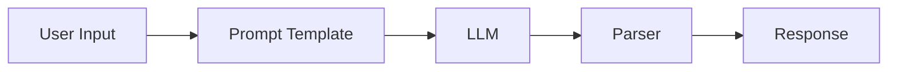
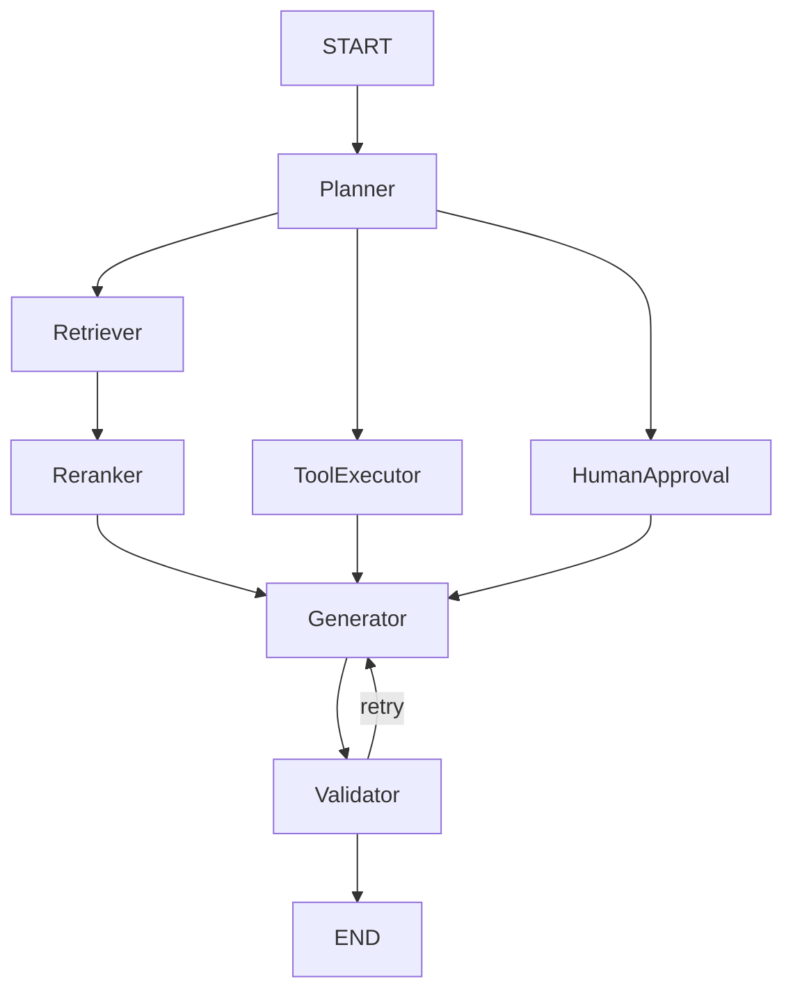
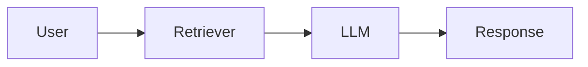
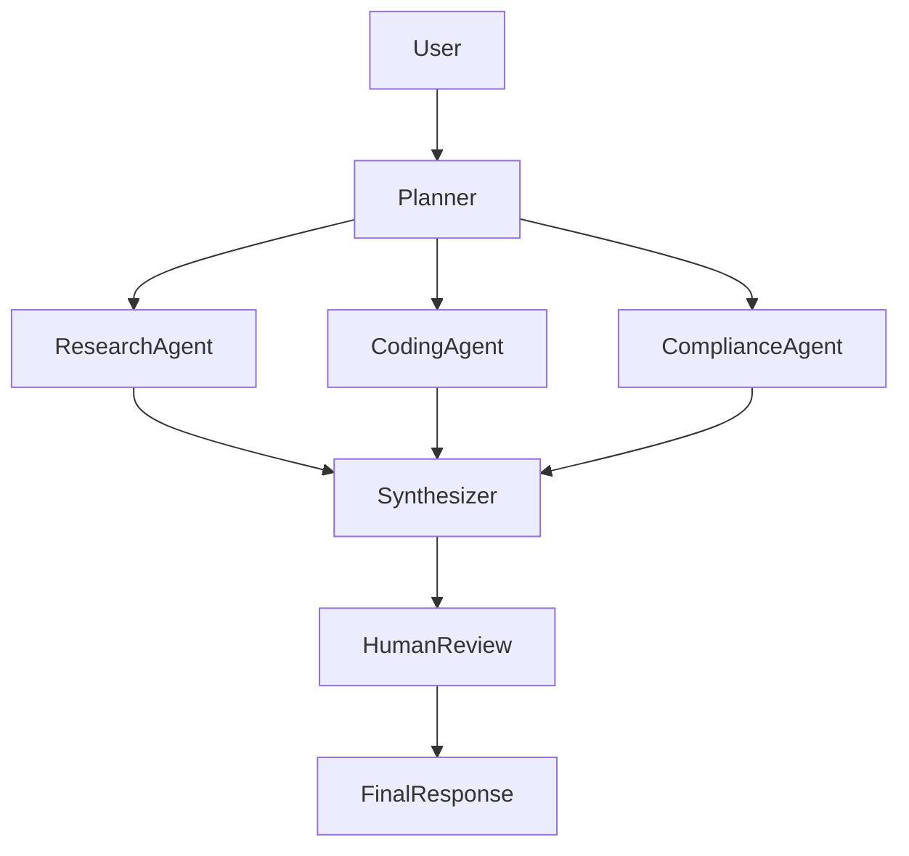
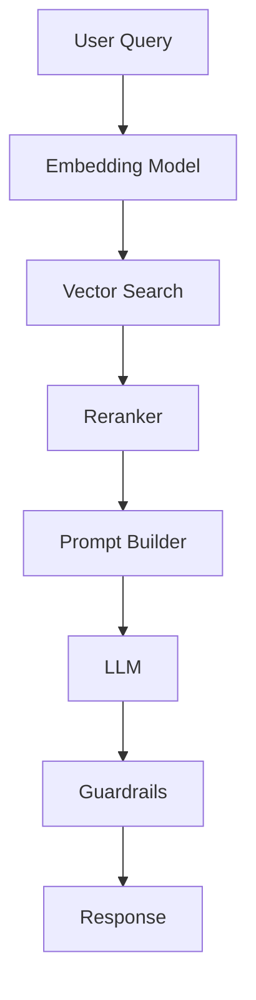
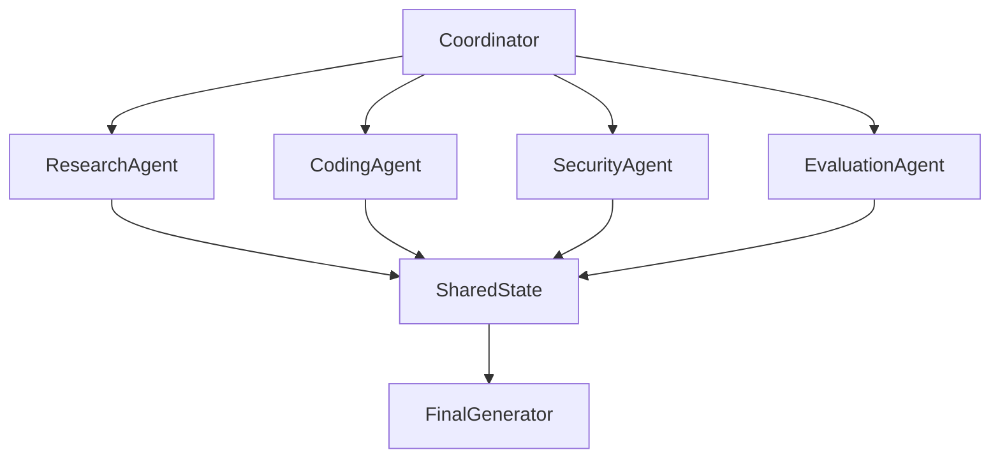
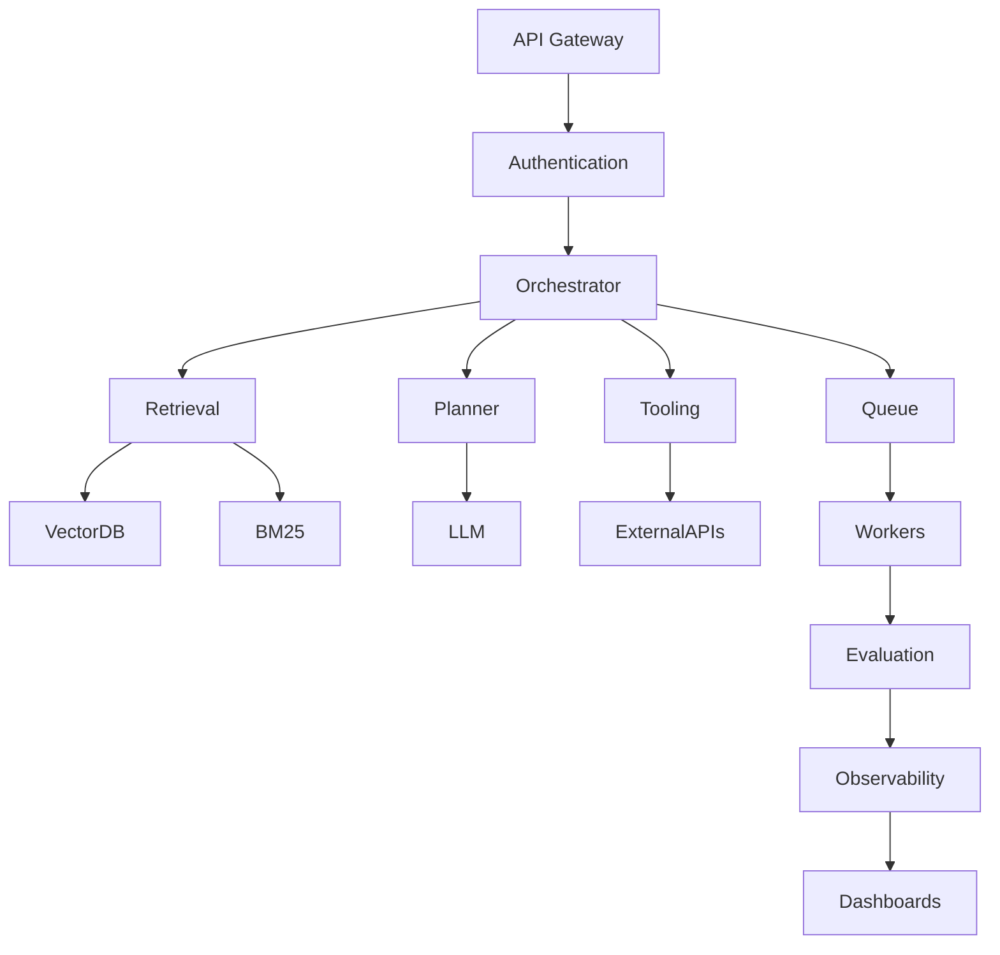

# LangChain, LangGraph, and the New AI Orchestration Stack: Designing Production-Grade LLM Systems

## Introduction

The first generation of LLM applications was simple:

```python
prompt -> OpenAI API -> response
```

That architecture worked for demos, prototypes, and small internal tools.

Production AI systems are very different.

Modern enterprise AI applications require:

* Retrieval-Augmented Generation (RAG)
* multi-step reasoning
* tool calling
* streaming
* memory
* human approval workflows
* retries and fallback models
* observability
* structured outputs
* long-running tasks
* multi-agent orchestration
* permission-aware context injection
* async workflows
* cost optimization
* deterministic execution

This complexity created an entirely new infrastructure category:

> AI orchestration frameworks

The most popular ecosystem today is centered around:

* LangChain
* LangGraph

But the ecosystem has expanded rapidly with alternatives such as:

* LlamaIndex
* Haystack
* AutoGen
* CrewAI
* DSPy
* Semantic Kernel
* OpenAI Agents SDK

This article explores:

* what LangChain actually solves
* why LangGraph exists
* how modern AI orchestration architectures evolved
* where alternative frameworks fit
* production design patterns
* scaling considerations
* observability and reliability
* real-world deployment strategies

---

# Why AI Applications Need Orchestration

Traditional backend systems are deterministic.

LLM systems are probabilistic.

That changes everything.

A normal API flow:

```text
request -> business logic -> database -> response
```

LLM systems often become:

```text
request
  -> classify intent
  -> retrieve documents
  -> rerank results
  -> select tools
  -> invoke APIs
  -> summarize outputs
  -> validate hallucinations
  -> retry if malformed
  -> stream partial response
  -> persist memory
  -> audit logs
  -> return result
```

This is no longer a single function call.

It is a workflow engine.

---

# What is LangChain?

LangChain is an orchestration framework designed to simplify the construction of LLM-powered systems.

Core abstractions include:

| Component        | Purpose                   |
| ---------------- | ------------------------- |
| LLM wrappers     | Unified model interface   |
| Prompt templates | Structured prompting      |
| Chains           | Sequential execution      |
| Retrievers       | Vector search abstraction |
| Memory           | Conversation state        |
| Agents           | Dynamic tool execution    |
| Tools            | External API integration  |
| Output parsers   | Structured outputs        |
| Callbacks        | Observability/hooks       |

The original LangChain philosophy was:

> "Compose AI applications from reusable primitives."

---

# Core LangChain Architecture

## Basic Chain Flow



---

# Example: Simple LangChain Workflow

```python
from langchain_openai import ChatOpenAI
from langchain.prompts import ChatPromptTemplate
from langchain_core.output_parsers import StrOutputParser

llm = ChatOpenAI(model="gpt-4.1")

prompt = ChatPromptTemplate.from_template(
    "Explain {topic} like a senior engineer."
)

chain = prompt | llm | StrOutputParser()

result = chain.invoke({
    "topic": "vector databases"
})

print(result)
```

This composition syntax became one of LangChain's most important innovations.

---

# LangChain's Biggest Strength

LangChain became dominant because it unified fragmented AI tooling.

Before LangChain:

* every vector database had different APIs
* every model provider behaved differently
* prompt handling was inconsistent
* tool execution logic was custom
* memory systems were ad hoc

LangChain normalized these interfaces.

Example:

```python
from langchain_community.vectorstores import PGVector
from langchain_community.vectorstores import Qdrant
from langchain_community.vectorstores import Milvus
```

The application code stays mostly unchanged.

That portability became extremely valuable in production.

---

# The Problem with Early LangChain Agents

Early LangChain agents were powerful but difficult to control.

Typical agent loop:

```text
Thought
Action
Observation
Thought
Action
Observation
Final Answer
```

This created issues:

* non-deterministic execution
* recursive loops
* hard debugging
* poor state management
* unreliable retries
* weak persistence
* difficult human approval flows

As AI systems became more production-critical, these problems became severe.

This led to the creation of LangGraph.

---

# What is LangGraph?

LangGraph is a graph-based orchestration framework built on top of LangChain.

Instead of treating AI workflows as chains:

```text
A -> B -> C
```

LangGraph models them as stateful directed graphs.

---

# LangGraph Architecture



This architecture resembles:

* workflow engines
* distributed state machines
* DAG schedulers
* event-driven systems

More than traditional prompt pipelines.

---

# Why LangGraph Matters

LangGraph solves several production problems.

## 1. Stateful Execution

Traditional chains lose context between steps.

LangGraph maintains persistent shared state.

Example:

```python
class AgentState(TypedDict):
    messages: list
    retrieved_docs: list
    tool_results: dict
    retries: int
```

This becomes critical for:

* long-running workflows
* multi-step planning
* resumable execution
* human-in-the-loop systems

---

## 2. Deterministic Routing

Instead of free-form agent loops:

```python
if state["intent"] == "search":
    return "retriever"

if state["intent"] == "api_call":
    return "tool_executor"
```

This improves:

* reliability
* debugging
* observability
* compliance
* cost predictability

---

## 3. Checkpointing

Production AI systems fail frequently:

* provider timeouts
* malformed JSON
* tool failures
* rate limits
* partial context corruption

LangGraph supports resumable execution.

This is extremely important for enterprise systems.

---

# LangChain vs LangGraph

| Feature                | LangChain        | LangGraph         |
| ---------------------- | ---------------- | ----------------- |
| Primary Model          | Chains           | Stateful graphs   |
| Best For               | Simple pipelines | Complex workflows |
| State Handling         | Limited          | First-class       |
| Determinism            | Moderate         | High              |
| Multi-Agent            | Basic            | Strong            |
| Long-running Tasks     | Weak             | Strong            |
| Human Approval         | Difficult        | Native            |
| Retry Logic            | Manual           | Structured        |
| Workflow Visualization | Limited          | Strong            |
| Observability          | Good             | Excellent         |
| Production Reliability | Medium           | High              |
| Complexity             | Lower            | Higher            |

---

# When to Use LangChain

LangChain is ideal for:

* simple RAG apps
* chatbots
* internal tools
* prototypes
* lightweight assistants
* quick integrations
* single-agent systems

Example architecture:



Good enough for many applications.

---

# When to Use LangGraph

LangGraph becomes valuable when systems require:

* branching workflows
* multiple agents
* approval steps
* retries
* durable execution
* long-running state
* async coordination
* orchestration logic

Example:



This is closer to enterprise AI systems.

---

# Production RAG with LangChain

A typical production RAG stack:



---

# Example Production Components

| Layer         | Common Tools               |
| ------------- | -------------------------- |
| Embeddings    | OpenAI, BGE, E5, Nomic     |
| Vector DB     | pgvector, Qdrant, Pinecone |
| Reranker      | BGE reranker, Cohere       |
| Orchestration | LangChain/LangGraph        |
| Storage       | PostgreSQL, Redis          |
| Streaming     | SSE/WebSockets             |
| Monitoring    | LangSmith, OpenTelemetry   |
| Queue         | SQS, Kafka, RabbitMQ       |

---

# LangChain in Enterprise RAG

Production patterns often include:

## Hybrid Retrieval

```text
BM25 + vector search
```

Instead of only embeddings.

---

## Reranking

Initial vector retrieval is noisy.

Rerankers improve precision dramatically.

```text
top 100 retrieved
    -> rerank
        -> top 5 final
```

---

## Context Compression

Large contexts are expensive.

Compression pipelines reduce token usage.

Example:

```text
retrieve 50 docs
    -> summarize
        -> compress
            -> inject top context
```

---

# Multi-Agent Systems with LangGraph

Modern AI systems increasingly resemble distributed systems.

Example multi-agent architecture:



This enables specialization.

---

# Real Production Use Cases

## 1. AI Coding Assistant

Architecture:

```text
User request
  -> repo retrieval
  -> semantic search
  -> code planner
  -> tool execution
  -> patch generation
  -> test execution
  -> evaluation
```

Typical frameworks:

* LangGraph
* DSPy
* OpenAI Agents SDK

---

## 2. Enterprise Knowledge Assistant

```text
User
  -> permission validation
  -> multi-source retrieval
  -> reranking
  -> hallucination checks
  -> summarization
```

Often uses:

* LangChain
* LlamaIndex
* Haystack

---

## 3. Customer Support AI

```text
Question
  -> intent detection
  -> policy retrieval
  -> CRM API calls
  -> escalation logic
  -> response generation
```

Common requirement:

* deterministic routing
* auditability
* approval flows

LangGraph performs well here.

---

# LangChain Alternatives

---

# LlamaIndex

LlamaIndex focuses heavily on data ingestion and retrieval pipelines.

Strengths:

* advanced indexing
* document parsing
* retrieval quality
* structured document handling
* enterprise connectors

Best for:

* document-heavy RAG
* enterprise search
* knowledge systems

---

# Haystack

Haystack originated earlier in the NLP ecosystem.

Strengths:

* mature retrieval systems
* search-heavy architectures
* Elasticsearch integration
* production search pipelines

Popular in:

* enterprise NLP
* search infrastructure teams

---

# DSPy

DSPy takes a very different approach.

Instead of hand-writing prompts:

```python
class QA(dspy.Signature):
    question = dspy.InputField()
    answer = dspy.OutputField()
```

DSPy optimizes prompts automatically.

This is extremely interesting for:

* prompt optimization
* evaluation-driven systems
* self-improving pipelines

---

# AutoGen

AutoGen focuses heavily on conversational multi-agent systems.

Architecture example:

```text
Planner Agent
  <-> Research Agent
  <-> Code Agent
  <-> Critic Agent
```

Strong for experimentation.

Weaker for deterministic enterprise execution.

---

# CrewAI

CrewAI simplifies multi-agent coordination.

Concepts:

* agents
* tasks
* crews
* collaboration flows

More approachable than LangGraph for smaller teams.

---

# Semantic Kernel

Semantic Kernel is Microsoft's orchestration framework.

Strong areas:

* enterprise integrations
* .NET ecosystem
* planner abstractions
* plugin systems

Popular in Azure-heavy enterprises.

---

# OpenAI Agents SDK

OpenAI Agents SDK is designed for native OpenAI agent workflows.

Strengths:

* tool calling
* structured outputs
* native OpenAI integrations
* streaming support
* simplified agent orchestration

Still evolving rapidly.

---

# Modern Production Architecture

A realistic enterprise AI system today often looks like this:



This is no longer "just prompting."

It resembles distributed systems engineering.

---

# Observability and Monitoring

Production AI systems require deep telemetry.

Important metrics:

| Metric              | Why It Matters          |
| ------------------- | ----------------------- |
| token usage         | cost control            |
| latency             | UX                      |
| retrieval precision | hallucination reduction |
| tool failure rate   | reliability             |
| retry count         | provider health         |
| hallucination rate  | trust                   |
| prompt versioning   | reproducibility         |
| evaluation score    | regression detection    |

---

# Common Production Failure Modes

## Infinite Agent Loops

Classic ReAct-style agents may recurse forever.

LangGraph reduces this risk using controlled state transitions.

---

## Context Explosion

Too many retrieved documents:

```text
huge context
    -> token explosion
        -> latency increase
            -> cost increase
```

Compression and reranking become mandatory.

---

## Tool Misuse

Agents calling APIs incorrectly:

* wrong parameters
* repeated calls
* dangerous actions

Production systems require:

* permission boundaries
* schema validation
* rate limiting
* approval workflows

---

# Why the Industry is Moving Toward Graph-Based AI Systems

Simple chatbots are commoditized.

The next generation of AI systems involves:

* orchestration
* memory
* workflows
* planning
* execution graphs
* distributed agents
* event-driven architectures

LangGraph reflects this shift.

The architecture increasingly resembles:

* Airflow
* Temporal
* Cadence
* state machines
* DAG orchestration systems

Combined with LLM reasoning.

---

# Choosing the Right Framework

| Use Case                         | Recommended           |
| -------------------------------- | --------------------- |
| Simple chatbot                   | LangChain             |
| Basic RAG                        | LangChain             |
| Enterprise RAG                   | LangChain + LangGraph |
| Multi-agent systems              | LangGraph             |
| Long-running workflows           | LangGraph             |
| Prompt optimization              | DSPy                  |
| Document-heavy retrieval         | LlamaIndex            |
| Search-heavy systems             | Haystack              |
| Experimental agent swarms        | AutoGen               |
| Simplified multi-agent workflows | CrewAI                |
| Microsoft enterprise ecosystem   | Semantic Kernel       |

---

# Final Thoughts

The AI orchestration ecosystem is evolving rapidly.

LangChain helped standardize the first generation of LLM application development.

LangGraph represents the transition from:

```text
prompt engineering
```

to:

```text
AI systems engineering
```

Production AI applications are increasingly becoming:

* distributed systems
* workflow engines
* stateful orchestration platforms
* retrieval pipelines
* event-driven architectures

The future of enterprise AI is not a single prompt.

It is orchestrated intelligence systems composed of:

* models
* retrieval
* tools
* memory
* evaluation
* workflows
* observability
* human oversight

LangChain and LangGraph sit at the center of that transition.
