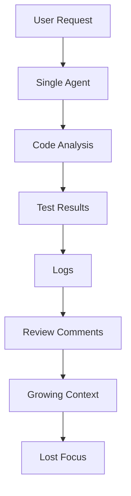
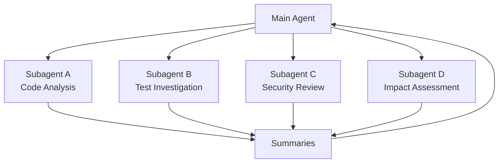
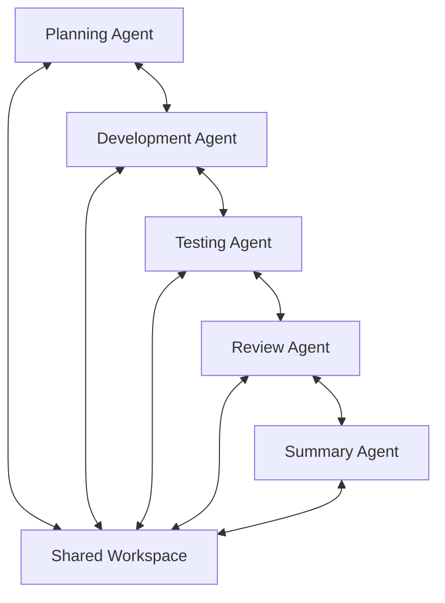
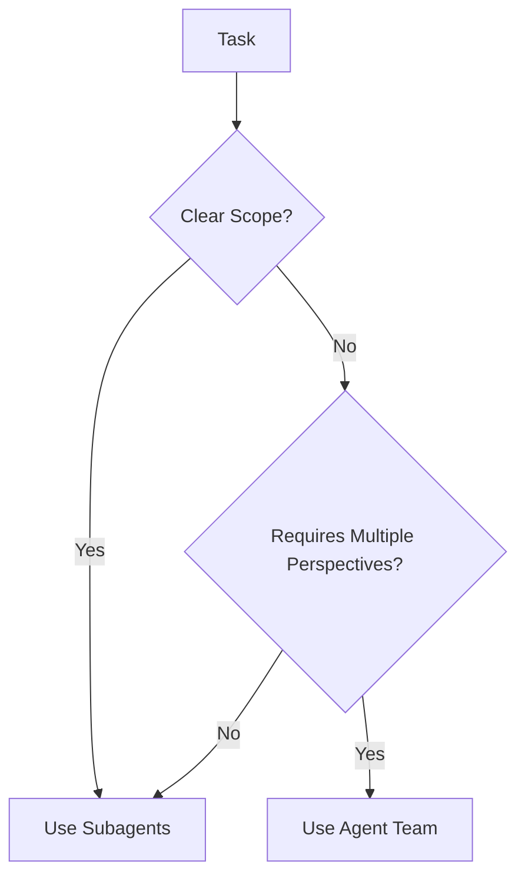

# From Subagents to Agent Teams: Two Collaboration Patterns in Multi-Agent Systems

As AI agents become increasingly capable, many developers are running into a new challenge:

Some tasks have become too large, too complex, or too context-heavy for a single agent to handle from start to finish.

Traditionally, we talked about "an agent completing a task" as if it were a straight line from input to output. In reality, especially in software engineering, many tasks naturally decompose into multiple stages:

* Reading code
* Understanding APIs
* Implementing changes
* Writing tests
* Analyzing logs
* Performing code reviews
* Evaluating risks

None of these individual steps are particularly difficult. The real challenge is that all of the information generated during the process accumulates inside a single context window.

As context grows, the agent's reasoning often becomes less reliable:

* Previously confirmed requirements may be forgotten.
* Unresolved log issues become mixed with test outputs.
* Review comments overwhelm the original objective.
* Important details get buried under intermediate artifacts.

To address this problem, two major collaboration patterns have emerged in modern multi-agent systems:

1. **Subagents**
2. **Agent Teams**

Both attempt to solve the problem that a single agent is no longer sufficient, but they do so in fundamentally different ways.

---

# Subagents: Specialized Assistants Delegated by a Main Agent

A Subagent can be thought of as a specialized assistant dispatched by a primary agent.

The primary agent remains responsible for:

* Understanding the overall goal
* Maintaining task ownership
* Making final decisions
* Coordinating execution

Meanwhile, Subagents are assigned narrowly scoped tasks.

Consider a request to modify an authentication system.

Before making changes, several questions must be answered:

* Where is the authentication logic implemented?
* Why are existing tests failing?
* Does the modification introduce security risks?
* Will the change affect other modules?

Instead of investigating everything itself, the primary agent may delegate:

* Subagent A → Authentication code analysis
* Subagent B → Test failure investigation
* Subagent C → Security assessment
* Subagent D → Impact analysis

Each Subagent focuses exclusively on its assigned responsibility.

After completing its work, it returns only the summarized findings to the primary agent.

The greatest value of Subagents is **context isolation**.

In real-world development environments:

* Test logs may contain thousands of lines.
* Code searches may touch dozens of files.
* Dependency analysis may uncover large amounts of irrelevant information.

If all of this is injected into the main conversation, the primary agent can easily become distracted.

Instead, Subagents process the raw information independently and return concise conclusions such as:

* "Three files contain the relevant authentication logic."
* "Most failures originate from session expiration handling."
* "The change may affect authorization checks."
* "Additional testing is recommended for abnormal login scenarios."

The primary agent receives only the distilled outcome, keeping its working context clean and focused.

Subagents are therefore best understood as a **task delegation mechanism**.

The primary agent does not need to personally handle every detail. It simply assigns clear tasks and waits for summarized results.

---

# When to Use Subagents

Subagents excel when tasks have:

* Clear boundaries
* Independent execution paths
* Well-defined outputs

Examples include:

### Code Discovery

Finding:

* Relevant files
* Function definitions
* Dependency chains
* Call graphs

### Test Analysis

Identifying:

* Failed test cases
* Root causes
* Regression risks

### Documentation Review

Summarizing:

* Architecture documents
* API specifications
* Design decisions

### Code Review

Checking for:

* Obvious bugs
* Style violations
* Security concerns

### Information Retrieval

Extracting:

* Relevant research
* Internal knowledge
* Technical references

These tasks share a common characteristic:

They do not require continuous discussion.

The Subagent performs the work and returns a conclusion.

However, some problems require more than delegation.

---

# When Delegation Is Not Enough

Imagine investigating a complex production bug.

Potential causes may include:

* Frontend state management
* Backend APIs
* Database transactions
* Cache invalidation
* Concurrency issues

Several Subagents could independently investigate these areas.

The problem is that their conclusions may conflict:

* One agent blames caching.
* Another suspects race conditions.
* A third identifies API inconsistencies.

Which explanation is correct?

Which hypothesis deserves further validation?

How should conflicting findings be reconciled?

This is where Agent Teams become useful.

---

# Agent Teams: Multiple Agents Collaborating as a Team

As the name suggests, an Agent Team is a small team composed of multiple agents working toward a shared objective.

The fundamental difference from Subagents is that:

**Subagents perform delegated tasks.**

**Agent Teams collaborate around a common goal.**

Example roles might include:

* Planning Agent
* Implementation Agent
* Testing Agent
* Review Agent
* Documentation Agent

Unlike Subagents, these agents are not isolated workers.

They can:

* Exchange information
* Challenge assumptions
* Validate each other's work
* Collaborate on decision making

This resembles how real engineering teams operate.

The primary value of Agent Teams is not merely parallel execution.

The true advantage is **multi-perspective validation**.

Consider a code review scenario:

### Security Agent

> This endpoint lacks authorization checks.

### Performance Agent

> Adding authorization here may increase database load.

### Testing Agent

> We should include cache invalidation test cases.

### Maintainability Agent

> The logic should be extracted into a separate service.

Each agent contributes a different perspective.

The goal is not redundancy.

The goal is complementary expertise.

---

# When to Use Agent Teams

Agent Teams are most effective for:

* Complex reasoning
* Open-ended problems
* Multi-stage decision making
* Cross-functional collaboration

Examples include:

## Complex Bug Investigation

Different agents evaluate different hypotheses simultaneously.

## Cross-Module Development

Separate agents handle:

* Frontend
* Backend
* Infrastructure
* Testing

while coordinating through shared context.

## Architecture Design

One agent proposes a solution.

Another evaluates risks.

A third estimates implementation cost.

A fourth reviews scalability implications.

## Large Refactoring Projects

Different roles manage:

* Code understanding
* Migration planning
* Implementation
* Validation
* Risk analysis

These tasks require discussion, validation, and synchronization rather than simple execution.

---

# Choosing Between Subagents and Agent Teams

A useful rule of thumb is:

> If the task has clear boundaries and only needs a final result, use Subagents.
>
> If the task requires multiple perspectives, continuous coordination, and mutual validation, use an Agent Team.

Another way to think about it:

| Pattern    | Analogy               |
| ---------- | --------------------- |
| Subagent   | Specialized assistant |
| Agent Team | Small project team    |

### Better suited for Subagents

* Code search
* Test execution
* Log analysis
* Documentation summarization
* Focused reviews

### Better suited for Agent Teams

* System design
* Complex debugging
* Cross-service development
* Large-scale refactoring
* Strategic decision making

---

# Industry Implementations

Many modern AI systems already embody these patterns.

## LangChain

LangChain's multi-agent architecture often follows the Subagent model.

A Supervisor Agent:

* Coordinates work
* Invokes specialized agents as tools
* Determines information flow
* Aggregates outputs

This closely matches the delegation pattern.

---

## Claude Code

Claude Code incorporates both approaches.

### Subagents

Used for:

* Code search
* Test analysis
* Documentation reading
* Code review

### Agent Teams

Used for:

* Shared task tracking
* Collaborative execution
* Inter-agent communication
* Coordinated problem solving

---

## OpenAI Codex

Codex supports specialized agents focused on:

* Security review
* Code quality
* Bug detection
* Race condition analysis
* Test reliability

These behave similarly to Subagents operating in parallel.

---

## AutoGen

AutoGen aligns more closely with the Agent Team model.

Its Group Chat architecture emphasizes:

* Shared conversations
* Collaborative reasoning
* Role-based interaction
* Multi-agent discussions

Multiple agents collectively work toward a solution while sharing the same discussion thread.

---

# Operational Challenges

While multi-agent systems are powerful, adding more agents does not automatically make a system better.

Both Subagents and Agent Teams introduce new coordination challenges.

## Subagent Risks

Tasks may become over-fragmented.

The primary agent may receive:

* Too many partial conclusions
* Conflicting findings
* Excessive summaries

Eventually, the burden shifts to the primary agent to reconcile everything.

---

## Agent Team Risks

The challenges become organizational:

* Who assigns tasks?
* Who determines priorities?
* Who resolves conflicts?
* Who owns final decisions?
* How are shared resources protected?

If multiple agents modify the same component simultaneously, coordination becomes increasingly difficult.

Without strong governance, multi-agent systems can easily evolve from:

> Parallel collaboration

into

> Parallel confusion

The critical factors are not the number of agents.

The critical factors are:

* Task boundaries
* Collaboration protocols
* Result aggregation mechanisms

---

# Conclusion

A useful way to remember the distinction is:

> Subagents solve the problem that a single agent cannot handle all of the work.
>
> Agent Teams solve the problem that a single perspective is insufficient.

Subagents emphasize **task decomposition**.

Agent Teams emphasize **role collaboration**.

In practice, many production-grade AI systems combine both approaches.

A supervisor agent may delegate information gathering to Subagents while simultaneously coordinating a Team of planning, implementation, testing, and review agents.

The future of multi-agent systems is not about having more agents talking at the same time.

The real value comes from placing the right agent in the right role, with the right responsibilities, at the right moment.

---

## Further Reading

* Designing Planning Layers for Coding Agents
* Building Self-Evolving Agents Through Source-Level Feedback Loops
* Agent Memory Architectures and Long-Horizon Task Execution
* Multi-Agent Orchestration Patterns in Production AI Systems
* From RAG Pipelines to Autonomous Engineering Agents
