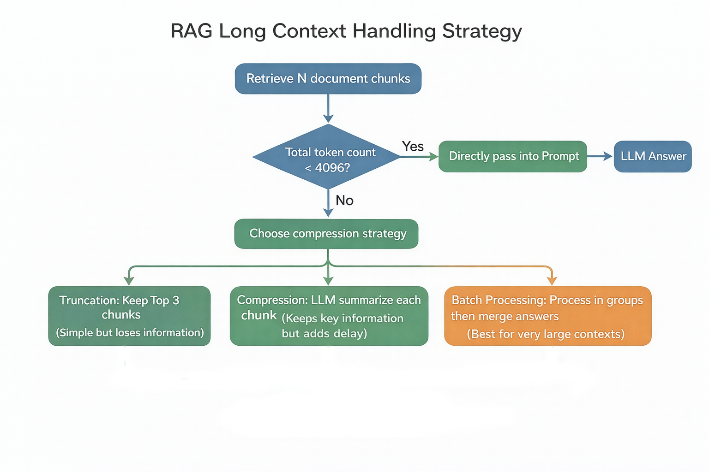

# Designing Robust Prompts for RAG Systems (Eliminating Hallucinations)

## Introduction

In Retrieval-Augmented Generation (RAG) systems, strong retrieval alone is **not enough**.

Even when:

* vector search is accurate
* reranking is applied
* top-k documents are highly relevant

…the final answer can still contain **hallucinations**.

Why?

Because the **prompt layer is the final control point**.
Retrieval finds the right documents — but **prompt design determines whether the model actually uses them correctly**.

---

## 1. The Core Challenge of RAG Prompts

RAG prompts are fundamentally different from standard LLM prompts.

### Standard LLM behavior

* Input: question
* Output: generated answer
* Knowledge source: **model parameters**

### RAG behavior

* Input: question + retrieved documents
* Requirement: **answer using ONLY retrieved documents**

---

### The Problem: Knowledge Mixing

LLMs naturally combine:

* retrieved content
* internal (pretrained) knowledge

This leads to **hallucination**.

#### Example

User asks:

> "What is the waiting period for critical illness insurance?"

Retrieved document:

> Waiting period = **180 days**

Model answer (bad prompt):

> "Usually 90 days"

Why?

* 90 days exists in training data
* model mixes sources

---

### Core Objective of RAG Prompting

👉 **Force the model to rely only on retrieved documents**
👉 **Block access to parametric knowledge**

---

## 2. System Prompt Design

The System Prompt defines global behavior and must include:

### 1. Role Definition

```text
You are a financial insurance assistant.
```

Purpose:

* restrict domain
* reduce irrelevant knowledge usage

---

### 2. Strong Rules (Positive Constraints)

```text
Only use information explicitly stated in the reference documents.
```

Key word: **explicitly**

Avoid:

* inference
* assumptions
* general knowledge

---

### 3. Refusal Strategy (Critical)

```text
If the documents do not contain enough information,
respond with:
"I cannot answer based on the provided documents."
```

Without this:

* model fills gaps using its own knowledge → hallucination

---

### 4. Citation Requirement (Most Effective Technique)

```text
Every statement must include a source:
[Source: Document Name, Page X]
```

Why it works:

* forces retrieval grounding
* adds implicit verification step
* reduces fabrication significantly

---

### 5. Numeric Consistency

```text
All numbers must exactly match the document.
```

Important for:

* finance
* legal
* medical

---

### 6. Confidence Signaling

```text
Use "According to the document..." when uncertain.
```

Adds:

* transparency
* trust calibration

---

## 3. User Prompt Design

User Prompt = **dynamic content layer**

It includes:

* retrieved documents
* user query

---

### Recommended Structure

```python
def build_rag_prompt(query: str, retrieved_docs: list) -> str:
    context_parts = []

    for i, doc in enumerate(retrieved_docs, 1):
        context_parts.append(
            f"Document {i} (Source: {doc['source']}):\n{doc['text']}"
        )

    context = "\n\n".join(context_parts)

    return f"""
Reference Documents:
{context}

User Question:
{query}

Answer ONLY based on the reference documents.
If insufficient information, say so.
"""
```

---

### Key Design Decisions

#### 1. Numbered documents

* avoids confusion
* improves citation accuracy

#### 2. Clear separation

* use double line breaks

#### 3. Documents BEFORE question

Order matters:

👉 **Documents → Question** reduces hallucination
👉 Question first may trigger parametric knowledge early

---

## 4. Constraint Strength Matters

Small wording differences → large performance impact

| Prompt Type       | Example                | Hallucination Rate |
| ----------------- | ---------------------- | ------------------ |
| Weak              | "Refer to documents"   | 18%                |
| Medium            | "Mainly use documents" | 12%                |
| Strong            | "Only use documents"   | 9%                 |
| Strong + Citation | + required sources     | **7%**             |

---

### Key Insight

Words like:

* "refer"
* "mainly"
* "try to"

👉 introduce ambiguity

Words like:

* **only**
* **must**
* **do not**

👉 enforce behavior

---

## 5. Long Context Handling

When context grows large (10–15 documents):

### Problems

* exceeds token limit
* "Lost in the Middle" effect

---

### Strategy 1: Truncation

* keep top-k (e.g., top 3)
* fast, but lossy

---

### Strategy 2: Query-Aware Compression (Recommended)

```python
def compress_context(docs, query):
    compressed = []

    for doc in docs:
        if len(doc['text']) > 500:
            summary = llm.invoke(
                f"Extract key info relevant to '{query}' (within 50 words):\n{doc['text']}"
            )
            compressed.append(summary.content)
        else:
            compressed.append(doc['text'])

    return "\n\n".join(compressed)
```

---

### Why Query-Aware Matters

❌ Generic summary → keeps intro sentences
✅ Query-aware → keeps **relevant info only**

---

### Strategy 3: Multi-Step Aggregation

Process:

1. split documents into batches
2. generate partial answers
3. merge final answer

Best for:

* complex queries
* multi-document reasoning

---

## 6. Evaluation and Iteration

Prompt design must be **measured**, not guessed.

---

### Metric: Faithfulness

Measures:

> how much of the answer is supported by documents

---

### Test Set Design

Include:

1. answer exists → should answer correctly
2. partial answer → should acknowledge gaps
3. no answer → should refuse

---

### Iteration Loop

1. identify bad case
2. find root cause
3. add rule
4. re-evaluate

---

### Example Fix

Problem:

* model mixes multiple products

Solution:

```text
If multiple entities exist, answer separately for each.
```

---

## 7. Key Takeaways

### Prompt Architecture

| Layer         | Responsibility               |
| ------------- | ---------------------------- |
| System Prompt | rules, constraints, behavior |
| User Prompt   | documents + query            |

---

### Most Important Techniques

* Strong constraint language ("only", "must")
* Mandatory citations
* Refusal mechanism
* Query-aware context compression

---

### Final Insight

> Retrieval finds the right information.
> Prompting ensures the model actually uses it.

---

## Source
https://mp.weixin.qq.com/s/8GKYJtG3SZDA_8KTN55ThQ

---


